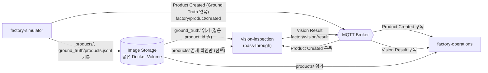
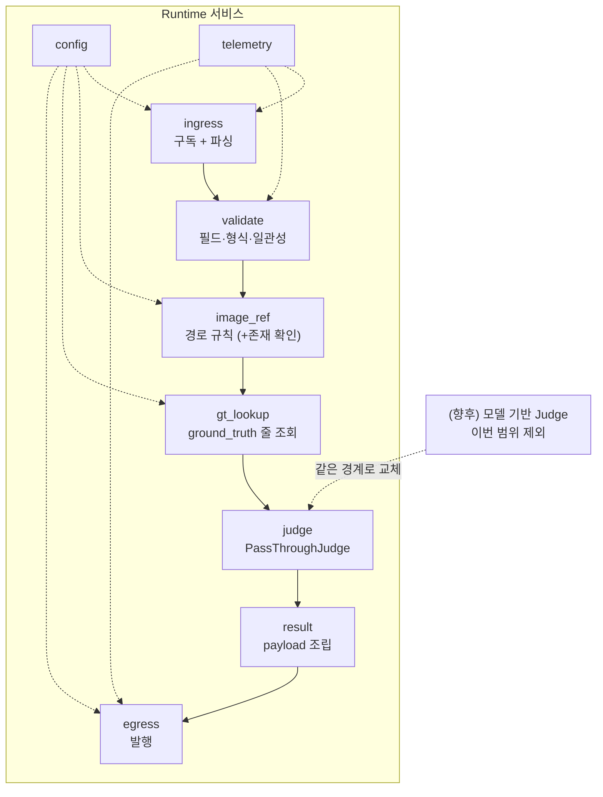
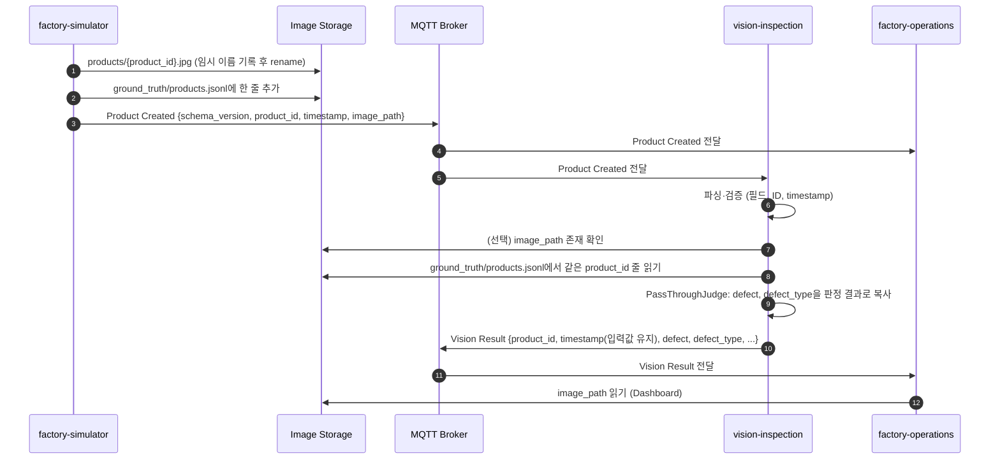

# Vision Quality Inspection 아키텍처 (초안)

> - 상태: **초안**, 사람 리뷰 전. 최초 작성과 범위 축소 개정 모두 2026-09-24
> - **범위 축소 결정 (2026-09-24, 사용자 결정)**: 이번 프로젝트에서 vision-inspection은 **AI 모델 판정을 하지 않는다**. YOLOv8/EfficientDet 결함 검출, Grad-CAM, 학습·평가가 모두 빠진다. 사용자가 말한 "VLM 판정 제외"는 이 AI 판정 전체를 뜻한다고 사용자가 확인했다(U-13 [결정]). 대신 Simulator가 제품의 불량 여부와 결함 정보를 보내고, 이 Component는 그 값을 **그대로(pass-through)** 검사 결과로 만들어 발행한다. 판정을 뺀 나머지(입력 수신·검증, 이미지 참조, ID·Timestamp, 결과 발행, 다운스트림 인터페이스 유지, 오류 처리, 관측성, 실행 형태)는 원래대로 설계한다.
> - **후속 사용자 결정 (2026-09-24)**: 구현은 Shared 승인 뒤에 한다. Shared 제기는 이 저장소가 한다(U-12). 실제 모델 판정으로 되돌릴지는 미정이다(U-10). 불량 정보를 Product Created와 분리해 별도 Topic으로 받는 방향을 제안 입장으로 했다(Q-20 (b)). 이 입장은 2026-09-27 D-6 재결정으로 폐기되었다(아래). Shared 승인 전까지는 모두 **제안**이다.
> - **Shared 제기 관련 사용자 결정 (2026-09-24, D-1~D-12)**: 범위 축소는 **과제 출제자의 승인을 받았다**(A§16의 Simulator 변경 선례와 같은 근거). 계약 변경 승인 책임자는 사용자 본인이다(A§19와 Shared CODEOWNERS 반영은 Shared 쪽 변경이므로 이슈에 담는다). 제기 방식, 입력·출력 필드 처리, 이슈 구성은 11.3절과 11.7절에 적었다.
> - 이 결정은 Shared 계약(A§2, §4.3, §8, §17, §19.1, I:Interface 후보, I:Image Reference)과 충돌하거나 계약 변경을 요구한다. 해당 항목은 11.1절 "Shared 제기 필요"에 모았다. 다른 저장소와 shared-repository는 수정하지 않았다.
> - 참고한 Shared 기준: `dltndn-personal-project/smart-factory-shared-repository`의 `main` 브랜치 commit `6bcd2aad8e374a7e96f816051585a49cb5e30f86` (2026-09-24T02:11:37Z). 읽은 문서는 `docs/ARCHITECTURE.md`, `docs/INTERFACES.md`, `docs/CONVENTIONS.md`
> - `SHARED_CONFIG.json`의 `contract_ref`가 `null`(계약 미채택)이라서 위 commit은 **참고용으로만** 읽었다(`agent/core/process/90-shared.md` 2절 방식). 이 문서의 계약 매핑은 구현 기준이 아니다.
> - **2026-09-27 갱신**: Shared `main`이 `8b1efb06325f711814152f4867d86e4413b4a404`로 바뀌었다. I-1·I-4 게시, 승인 책임자 @dltndn 지정(ISSUE-95d74411), factory-simulator 계약 반영(ISSUE-9f81b8ac, ISSUE-fde005ee)이 merge되었다. 이 변경으로 Product Created에는 결함 정보가 없고(`schema_version` 1, 밀리초 timestamp), runtime Ground Truth는 `ground_truth/products.jsonl`에 두되 평가·검증 전용이며 MQTT로 전달하지 않는다. 그래서 4.2절의 별도 Topic 제안(D-6)은 다시 결정해야 했다(아래 D-6 재결정). 범위 축소와 Vision Result를 담은 첫 DOCUMENT_CHANGE 초안(`ISSUE-e156d982…`, Shared PR #5)은 merge되지 않고 닫혔다. 이 문서의 3~4절 계약 매핑은 아직 `6bcd2aad` 기준이며, 계약 채택(SHARED-5) 때 다시 맞춘다.
> - **D-6 재결정 (사용자, 2026-09-27)**: 불량 정보 경로는 (b)로 한다. Vision은 Product Created를 받은 뒤 `ground_truth/products.jsonl`에서 같은 `product_id` 줄을 읽어 `defect`, `defect_type`을 얻는다. factory-simulator 구현은 바꾸지 않고, Ground Truth 사용 목적에 Vision pass-through 예외를 추가한다. 별도 MQTT Topic 안은 폐기했다. Shared PR #5는 사용자가 닫았고, 범위 축소·입력 경로·Vision Result를 한 DOCUMENT_CHANGE `ISSUE-c8fad59b-796c-42aa-b969-be0be65eae43`(Shared PR #6)로 다시 올렸고, 2026-09-26T16:08:12Z에 merge되었다(Shared merge commit `d0c997c97129141d9853a42ce6e0d1f8f7309ae9`). 이 문서의 3~4절 계약 매핑은 SHARED-5(contract_ref 채택) 때 `d0c997c` 기준으로 맞춘다. 1.5, 2, 3, 4.1, 4.2, 4.4, 5.1, 6.1, 9절은 이 결정으로 고쳤다.

## 0. 문서 안내

### 0.1 표기

| 표기 | 뜻 |
|---|---|
| `A§n` | Shared `docs/ARCHITECTURE.md`의 n절 |
| `I:<절 이름>` | Shared `docs/INTERFACES.md`의 해당 절 |
| `C:<절 이름>` | Shared `docs/CONVENTIONS.md`의 해당 절 |
| **[근거]** | 위 Shared 문서에 명시된 내용 (단, `contract_ref` 미채택 상태의 참고 기준) |
| **[가정]** | Shared에 근거가 없어 이 문서가 임시로 세운 작업 가정. 확정이 아니다 |
| **[미정]** | 결정이 필요하다. 11절의 ID(`Q-n` Shared, `L-n` 내부, `U-n` 사용자, `R-n` 조사)와 연결된다 |
| **[결정]** | 사용자가 결정했다(날짜 병기). Shared 계약 변경이 필요한 결정은 이 저장소의 제안 입장이며 Shared 승인 전까지 확정이 아니다 |
| **[제안]** | 이 저장소가 Shared에 제기할 제안 내용이다 |
| **[범위 제외]** | 2026-09-24 범위 축소 결정으로 이번 프로젝트에서 하지 않는다 |
| **[충돌]** | 범위 축소 결정이 Shared 문서와 어긋난다. 11.1절에 대응 질문이 있다 |

### 0.2 다른 문서와의 관계

- `docs/COMPONENT.md`는 Agent 절차가 참조하는 도메인 슬롯이며 아직 `<미정>` 상태다(BOOT-1 대상). 이 문서가 리뷰로 확정되면 요약을 COMPONENT.md로 옮긴다.
- 현재 저장소에는 코드와 실행 설정이 없다. `agent/config.yaml`의 `verify`도 비어 있다. 2절 이후의 모듈 구조와 기술 스택은 **제안**이다.

### 0.3 범위 축소로 바뀐 것

| 원래 설계 (Shared 기준) | 이번 범위 | 이 문서의 위치 |
|---|---|---|
| YOLOv8/EfficientDet 결함 검출 (A§4.3) | [범위 제외]. 입력의 불량 여부를 그대로 옮기는 pass-through로 대체한다 | 5절 |
| Grad-CAM 생성과 `gradcam/` 기록 (A§4.3, A§17, I:Image Reference) | [범위 제외] | 4.3, 4.4, 6.1절 |
| 전처리 (A§4.3 Preprocessing) | [범위 제외]. 이미지를 디코딩하지 않는다 | 3.2절 |
| 학습·평가 Offline 모듈, 모델 수명주기 | [범위 제외] | 5.2절 |
| mAP@0.5 ≥ 0.80, 20 FPS (A§2) | [범위 제외] [충돌]. 과제 출제자 승인을 근거로 제외한다 [결정] | 8절, Q-23 |
| 모델·GPU 관련 기술 스택 | [범위 제외] | 7절 |
| 입력 수신·검증, 이미지 참조, ID·Timestamp, 결과 발행, 오류 처리, 관측성, 실행 형태 | 유지 | 2~4, 6, 9, 10절 |

---

## 1. 책임 범위와 경계

### 1.1 역할

- Shared 기준 역할 [근거]: 제품 이미지를 분석해 품질 상태를 추론한다. Product Image를 Quality Information으로 바꾼다(A§4.3, "Quality Intelligence" A§18).
- 이번 범위의 역할 [범위 제외 반영]: Simulator가 `ground_truth/products.jsonl`에 기록한 불량 여부와 결함 유형을 **검증하여 Vision Result 형식으로 발행하는 중계**를 맡는다. 시스템 데이터 흐름(A§7.2)에서 Vision 자리를 지키고, factory-operations가 기대하는 Vision Result 인터페이스를 유지하는 것이 목적이다. 이 변경은 [충돌] Q-19.

### 1.2 책임

| 책임 | 내용 | 출처 | 상태 |
|---|---|---|---|
| 입력 수신·검증 | Product Created를 구독하고 필드와 형식을 검증한다 | A§7.2, I:Product Created, C:ID, C:Timestamp | 유지 |
| Ground Truth 조회 | `ground_truth/products.jsonl`에서 같은 `product_id` 줄을 읽어 `defect`, `defect_type`을 얻는다(읽기 전용) | I:Ground Truth | [결정] D-6 재결정, [제안] Shared PR #6 |
| 이미지 참조 처리 | `image_path`가 규칙에 맞는지 확인하고 결과에 그대로 싣는다 | I:Image Reference | 유지 (이미지 내용은 읽지 않는다 [가정] L-7) |
| 판정 | Ground Truth 줄의 불량 여부와 결함 유형을 그대로 결과로 옮긴다 (pass-through) | 없음 | [충돌] Q-19, Q-20. Shared PR #6에서 예외로 제안 |
| Inspection Result 발행 | 결과를 MQTT로 factory-operations에 보낸다 | A§4.3 Output, A§7.2 | 유지 |
| Timestamp 유지 | 입력 이벤트의 timestamp를 바꾸지 않고 결과에 싣는다 | A§17, C:Timestamp | 유지 |
| Defect Detection (AI) | 모델 추론으로 결함을 검출한다 | A§4.3, A§17 | [범위 제외] |
| Grad-CAM | 검출 근거를 시각화한다 | A§4.3, A§17 | [범위 제외] |
| 모델 지표 산출 | mAP@0.5를 측정한다 | A§2, A§19.1 | [범위 제외] |

### 1.3 하지 않는 것

Shared 기준으로 하지 않는 일 [근거]:

| 하지 않는 일 | 담당 | 출처 |
|---|---|---|
| 진동 분석, Health Index 계산, 설비 상태 결정 | predictive-maintenance | A§4.3 Out of Scope, A§17 |
| Fault Level 판단·조작 | factory-simulator | A§4.3 Out of Scope, A§4.1 |
| 컨베이어 제어, 라인 정지 판단 | factory-operations (판단), factory-simulator (물리 정지) | A§4.3 Out of Scope, A§4.4, A§17 |
| 전체 불량률 관리, 설비-품질 상관분석, Dashboard, Alarm | factory-operations | A§4.3 Out of Scope, A§4.4, A§17 |
| 데이터베이스 접근·기록과 DDL. Inspection History는 Operations가 MQTT 결과를 받아 기록한다 | factory-operations | A§4.4 Data Persistence, A§5.3, A§17 |
| 제품 이미지 생성과 `products/` 기록 | factory-simulator | A§4.1, I:Image Reference |
| Ground Truth(불량 여부·결함 유형) 생성 | factory-simulator | A§3.4, A§8 |
| Image Storage 볼륨과 공통 인프라 실행 정의 | integration | A§19.1, I:Image Reference |
| Production 수준 요구(고가용성, 확장성, Retry·복구, 멱등성, 보안, 백업) | 범위 제외 | A§2, A§12, A§13 |

이번 범위에서 추가로 하지 않는 일 [범위 제외]:

- 이미지 디코딩, 전처리, 모델 추론, Grad-CAM, 학습·평가
- 입력의 불량 여부를 고치거나 보정하는 일. 받은 값이 틀려도 바로잡지 않는다. 형식 오류만 걸러 낸다(9절)

### 1.4 소유 데이터·자원

| 자원 | 내용 | 상태 |
|---|---|---|
| `gradcam/` 디렉터리 | Shared상 Vision만 기록하는 곳이다. 디렉터리는 유지하되 이번 범위에서는 기록하지 않아 비어 있다 | [근거] I:Image Reference, [결정] D-10, Q-25 |
| 모델 가중치, 학습 코드, 평가 결과 | 없음 | [범위 제외] |
| 실행 설정 (Broker URL, Topic, `IMAGE_ROOT` 등) | 설정 파일이나 환경 변수로 둔다 | [근거] A§14 |
| 영속 저장소 | 소유하지 않는다. 결과의 영속 기록은 factory-operations의 DB가 맡는다 | [근거] A§4.4 Data Persistence. 로컬 기록이 필요한지는 [미정] U-11 |

### 1.5 시스템 맥락



근거: A§3.3, A§7.2, I:Product Created, I:Ground Truth, I:Image Reference(Shared `8b1efb0`). Vision이 `ground_truth/products.jsonl`을 판정값 전달 목적으로 읽는 것은 Ground Truth 규칙의 예외이며 Shared PR #6에 [제안]으로 올렸다([결정] D-6 재결정). Ground Truth는 MQTT로 전달하지 않는다(A§8). Vision이 `gradcam/`에 기록하는 경로는 이번 범위에서 없다.

---

## 2. 내부 구성요소 [가정]

Shared의 처리 순서(A§4.3 Processing Pipeline, A§7.2)에서 추론·설명 단계를 pass-through 판정으로 바꾼 구조다. 모듈 구분은 이 문서의 제안이다.

### 2.1 Runtime 모듈

| 모듈 | 책임 | 관련 근거 |
|---|---|---|
| `config` | Broker URL, Topic 이름, `IMAGE_ROOT`, Ground Truth 파일 경로, 이미지 존재 확인 여부를 환경 변수나 설정 파일에서 읽는다 | A§14, C:실행 환경과 설정 |
| `ingress` (MQTT subscriber) | Product Created를 구독하고 JSON을 파싱한다. 모르는 필드는 무시한다 | A§3.2, A§7.2, I:Product Created, C:Payload |
| `validate` | Product Created의 필수 필드, `schema_version`, `product_id` 형식, timestamp 형식과 Ground Truth 줄의 `defect`·`defect_type` 일관성을 검사한다 | C:ID, C:Timestamp, I:Ground Truth |
| `image_ref` | `image_path`가 루트 기준 상대 경로이고 `products/` 아래인지 확인한다. 설정에 따라 파일 존재도 확인한다 | I:Image Reference. 존재 확인은 [가정] L-7 |
| `gt_lookup` | `ground_truth/products.jsonl`에서 같은 `product_id`의 완성된 줄(`\n`으로 끝난 줄)을 찾아 `defect`, `defect_type`만 돌려준다. 파일은 읽기 전용이다. 조회 방식(매번 처음부터 읽기, 읽은 위치 기억 등)은 구현에서 정한다 | I:Ground Truth, [결정] D-6 재결정. 조회 방식은 [가정] L-10 |
| `judge` | **판정 경계.** 이번 구현은 `PassThroughJudge` 하나이며, `gt_lookup`이 준 불량 정보를 판정 결과로 그대로 옮긴다 | 5절 |
| `result` | Vision Result payload를 조립한다. 모델 산출 필드는 `null`로, `judgement_source`는 `"PASS_THROUGH"`로 넣는다 | A§4.3 Output, [결정] D-7~D-9 |
| `egress` (MQTT publisher) | Vision Result를 발행한다 | A§4.3, A§7.2 |
| `telemetry` | 로그, 처리 건수, 단계별 소요 시간을 기록한다 | 10절 |

[범위 제외]: `preprocess`, `detector`, `postprocess`, `explainer`, `storage`의 Grad-CAM 기록, Offline `dataset`/`train`/`evaluate`.

### 2.2 구성도



### 2.3 디렉터리 구조 제안 [가정]

COMPONENT.md의 "구조" 슬롯과 task `scope` glob의 기준이 될 초안이다. 언어가 정해진 뒤 확정한다(L-1).

```text
src/vision_inspection/
  config.py  ingress.py  validate.py  image_ref.py  gt_lookup.py  judge.py
  result.py  egress.py  telemetry.py  main.py
tests/
config/              # 설정 예시 (실제 값이 든 .env는 commit하지 않는다, C:실행 환경과 설정)
```

---

## 3. 데이터 흐름

### 3.1 한 제품의 처리 순서



근거: A§7.2, A§4.3, I:Product Created(발행 전제: 이미지와 Ground Truth 기록이 끝난 뒤 발행), I:Ground Truth, I:Image Reference. 8번의 Ground Truth 읽기는 [결정] D-6 재결정이며 Shared PR #6에 [제안]으로 올렸다. 7번은 [가정] L-7, 9번은 5절에서 설명한다.

- Product Created 발행 전에 Ground Truth 줄 기록이 끝나므로, Vision이 Product Created를 받았을 때 그 줄은 이미 있다. [근거] I:Product Created 발행 전제
- 읽는 쪽은 `\n`으로 끝나지 않은 마지막 줄을 무시한다. [근거] I:Ground Truth
- Shared A§7.2 흐름과 비교하면 "Image Retrieval"은 이미지 존재 확인(선택)과 Ground Truth 줄 조회로 바뀌었고, "Inference"는 pass-through 판정으로 바뀌었으며, "Grad-CAM"은 빠졌다.

### 3.2 단계별 설명

| 단계 | 입력 → 출력 | 비고 |
|---|---|---|
| 1. 수신 | Product Created → 파싱된 이벤트 | 이미지 자체는 MQTT로 받지 않는다 [근거] A§3.3, A§5.4 |
| 2. 검증 | 이벤트 → 검증된 이벤트 또는 거부 | 규칙은 4.2절, 실패 시 동작은 9절 |
| 3. 이미지 참조 | `image_path` → 확인된 상대 경로 | 경로 규칙 확인은 [근거] I:Image Reference. 파일 존재 확인은 [가정] L-7. 디코딩은 하지 않는다 [범위 제외] |
| 4. Ground Truth 조회 | `product_id` → `defect`, `defect_type` | [결정] D-6 재결정. 줄이 없거나 읽지 못하면 발행하지 않는다(9절) |
| 5. 판정 | 조회한 불량 정보 → 판정 결과 | pass-through [충돌] Q-19, Q-20 |
| 6. 결과 조립 | 판정 결과, 입력 필드 → Vision Result | 모델 산출 필드는 `null` [결정] D-7, D-8 |
| 7. 발행 | Vision Result → MQTT | timestamp는 Product Created 값을 그대로 쓴다 [근거] C:Timestamp |
| (제외) 전처리, 추론, Grad-CAM | - | [범위 제외] |

---

## 4. 외부 인터페이스와 Shared 계약 매핑

Shared에는 **승인된 Interface가 아직 없다**(I 첫 문단). 아래 항목은 모두 후보이며 Payload Schema는 미정이다.

### 4.1 MQTT Topic

| 방향 | Interface | Topic | 상대 | 출처 (Shared `8b1efb0`) | 상태 |
|---|---|---|---|---|---|
| 구독 | Product Created | `factory/product/created` (QoS 1, retain false) | 생산자 factory-simulator, 함께 소비하는 factory-operations | I:Interface 목록, I:Product Created | [근거] 확정 |
| 발행 | Vision Result | `factory/vision/result` (QoS 1, retain false로 제안) | 소비자 factory-operations | I:Interface 목록(후보) | [제안] Shared PR #6에서 확정 요청 |

- Topic 이름은 코드에 하드코딩하지 않고 설정으로 받는다. [근거] A§14
- client id 등 연결 세부는 공통 규칙이 없다. factory-simulator는 MQTT 3.1.1, clean session이다(I:Interface 목록). [미정] Q-7 일부
- 사용하지 않는 Interface: Sensor Vibration, PdM Result, Alarm Event, Conveyor Control, Line Status. [가정]
- 별도 불량 정보 Topic 안은 2026-09-27 D-6 재결정으로 폐기했다.

### 4.2 입력: Product Created + Ground Truth 조회 [결정] D-6 재결정

**Product Created** (I:Product Created, Shared `8b1efb0` 확정)

| 필드 | 예 | 용도 | 출처 |
|---|---|---|---|
| `schema_version` | `1` | 계약 버전. 모르는 필드는 무시한다 | C:Payload |
| `product_id` | `P-00000113` | Ground Truth 조회 키이자 결과 연결 키. `^P-[0-9]{8}$` | C:ID |
| `timestamp` | `2026-09-25T05:20:13.425Z` | 캡처 시각. 결과에 그대로 싣는다(밀리초 3자리) | C:Timestamp, I:Product Created |
| `image_path` | `products/P-00000113.jpg` | 결과에 그대로 싣는다. 존재 확인은 선택 | I:Image Reference |

- Product Created에는 결함 여부·유형·위치와 Fault Level이 없다. [근거] I:Product Created, A§8

**Ground Truth 조회** (I:Ground Truth. Vision의 읽기는 Shared PR #6에 [제안]으로 올린 예외다)

- 파일: Image Storage의 `ground_truth/products.jsonl`. 읽기 전용이다. 기록자는 factory-simulator 하나다.
- 조회: 같은 `product_id`의 완성된 줄(`\n`으로 끝난 줄)을 찾는다. 완성되지 않은 마지막 줄은 무시한다.
- 사용 필드: `defect`(bool), `defect_type`(`scratch`|`dent`|`contamination`|null)만 쓴다. `bbox`가 있어도 Vision Result에 옮기지 않는다([결정] D-8). `fault_level`, `severity`, `defect_probability`, `defect_params`, `render_seed`는 쓰지 않는다.
- 시점: Product Created는 Ground Truth 기록이 끝난 뒤 발행되므로 수신 시점에 줄이 있다. [근거] I:Product Created 발행 전제
- 줄이 없거나 파일을 읽지 못하면 Vision Result를 발행하지 않고 로그로 남긴다(9절). 재시도는 하지 않는다(A§12).
- Ground Truth 정책과의 관계: Vision은 추론을 하지 않고 판정값을 옮기려고만 읽는다. 그래서 "AI 추론 입력으로 읽지 않는다" 원칙의 대상이 아니라는 예외를 Shared에 제안했다(A§3.4, §8, §17, I:Ground Truth, C:Ground Truth). Product Created 등 MQTT로 전달되는 AI 추론 입력에 Ground Truth를 넣지 않는 규칙과 Ground Truth 파일을 MQTT로 보내지 않는 규칙은 그대로다.
- factory-operations는 이 파일을 평가에만 쓴다는 A§17 규칙은 바뀌지 않는다. 다만 Vision Result의 결함 값이 Ground Truth와 같다는 점을 상관분석에서 어떻게 해석할지는 Operations 확인이 필요하다(Q-24).
- 향후 모델 판정으로 돌아가면 이 읽기는 없어지고, Vision은 Product Created와 이미지로 판정한다. 되돌릴지는 [미정] U-10.
- 일관성 규칙: `defect: false`이면 `defect_type`은 null이다. `defect: true`이면 `defect_type`이 허용 값 중 하나다. [근거] I:Ground Truth

### 4.3 출력: Vision Result

A§4.3 Output의 필드 집합을 유지하여 factory-operations가 기대하는 인터페이스를 바꾸지 않는다. 이 저장소의 제안 입장이며(D-7~D-9 [결정]), Shared 승인 전까지는 확정이 아니다(Q-22, Q-24).

| 필드 | 값의 출처 (이번 범위) | Shared 의미 | 출처 | 상태·질문 |
|---|---|---|---|---|
| `product_id` | 입력값 그대로 | 제품 식별자 | A§4.3, A§11 | [근거] |
| `timestamp` | 입력값 그대로 (문자열 재포맷 없음) | 이벤트 시각 | A§9, A§17, C:Timestamp | [근거]. 처리 시각 필드는 [미정] Q-6 |
| `defect` | 입력 `defect` 복사 | 결함 여부 (모델 판정) | A§4.3 | 값의 의미가 "판정"에서 "전달값"으로 바뀐다 [충돌] Q-24 |
| `defect_type` | 입력 `defect_type` 복사 | 결함 유형 (모델 판정) | A§4.1, A§4.3 | 표기는 Q-2, 불량 없음 표현은 Q-3 |
| `confidence` | 항상 `null` (키는 유지) | 검출 score | A§4.3 | [결정] D-7, Q-22. 고정값(예: 1.0)은 모델 확신도로 오해될 수 있어 쓰지 않는다 |
| `bbox` | 항상 `null` (키는 유지) | 검출 박스 | A§4.3 | [결정] D-8, Q-22. Operations DB의 `bbox`(A§5.3)는 비게 된다 |
| `image_path` | 입력값 그대로 | 제품 이미지 경로 | A§4.3, I:Image Reference | [근거] |
| `gradcam_path` | 항상 `null` (키는 유지) | Grad-CAM 결과 경로 | A§4.3 | [범위 제외], [결정] D-7, Q-22. Dashboard의 Grad-CAM 항목은 유지하되 이번 범위에서는 비어 있다 [결정] D-10 |
| `judgement_source` (선택 필드) | 고정값 `"PASS_THROUGH"` (CONVENTIONS 열거값 대문자 규칙) | Shared에 없다 | 없음 | **신규** [결정] D-9, Q-24. 소비자는 무시해도 된다. 나중에 모델 판정으로 돌아가면 다른 값으로 구분한다 |

- 모델 산출 필드는 키를 모두 두고 값은 `null`로 넣는다 [결정] D-7, D-8. 소비자의 파서가 필드 누락으로 깨지지 않게 하려는 것이다. Operations의 Dashboard는 null을 "없음"으로 표시해야 한다(Q-22에서 factory-operations에 알린다).
- Operations의 Relational DB 최소 필드(A§5.3) 중 `id`와 `health_index_at_time`은 Operations가 채운다. [근거] A§4.4

### 4.4 이미지 전달 방식

- 이미지는 MQTT에 싣지 않는다. 경로와 메타데이터만 보낸다. [근거] A§3.3, A§5.4
- Image Storage는 공유 Docker Volume 하나이며 볼륨 정의는 integration이 소유한다. [근거] I:Image Reference
- 경로는 루트 기준 상대 경로만 받고 보낸다. 절대 루트는 설정(`IMAGE_ROOT`)으로 받는다. [근거] I:Image Reference, C:실행 환경과 설정
- 이번 범위에서 Vision의 디렉터리 권한:

| 디렉터리 | Shared상 Vision 권한 [근거] | 이번 범위 |
|---|---|---|
| `products/` | 읽기 | 존재 확인만 (선택, L-7) |
| `ground_truth/products.jsonl` | 없음(평가·검증 전용) | 읽기 전용으로 같은 `product_id` 줄 조회 [결정] D-6 재결정, [제안] Shared PR #6 |
| `training/`, `evaluation/` | 읽기 (학습·평가) | 사용하지 않음 [범위 제외] |
| `gradcam/` | 기록 | 디렉터리는 유지하고 기록하지 않는다. 이번 범위에서는 비어 있다 [결정] D-10, Q-25 |

- 생산자는 파일 기록을 끝낸 뒤 이벤트를 발행하므로, 수신 시점에 파일이 완성되어 있다고 가정해도 된다. [근거] I:Image Reference

### 4.5 JSON Schema

- Shared 기준 commit에는 JSON Schema 파일이 없다. INTERFACES도 "Payload Schema는 미정"이다. [근거]
- 계약이 확정되면 그 Schema로 입력을 검증하고 출력 호환성을 테스트한다. 그 전까지는 4.2·4.3 표를 임시 기준으로 쓴다. [가정]

### 4.6 Timestamp 정책 [근거] A§9, C:Timestamp

- 형식은 UTC ISO 8601에 `Z` 접미사를 붙인다. Simulator가 만든 timestamp를 Vision은 바꾸지 않고 유지한다(A§17).
- 형식 검증은 하되, 받은 문자열을 파싱 후 재포맷하지 않고 그대로 전달한다. 밀리초 자릿수가 Shared에서 [미정]이어도 값이 바뀌지 않는다. [가정]

### 4.7 ID 정책 [근거] A§11, C:ID

- `product_id`: `^P-[0-9]{8}$`. 모든 Vision 결과에 포함한다.
- 유일성 범위, production sequence 정의, 형식 불일치 시 소비자 동작은 [미정] Q-9.
- `sensor_id`는 쓰지 않는다.

### 4.8 설정 항목 [근거] A§14, C:실행 환경과 설정

MQTT Broker URL, 구독·발행 Topic 이름, `IMAGE_ROOT`, 이미지 존재 확인 여부. 실제 값이 든 `.env`는 commit하지 않는다. 설정 키 이름은 [가정]이다. Shared가 예로 든 Model Path, Threshold는 이번 범위에서 쓰지 않는다.

---

## 5. 판정 단계와 모델 수명주기

### 5.1 Pass-through 판정

- 동작: `gt_lookup`이 준 `defect`, `defect_type`을 판정 결과로 복사한다. 값을 바꾸거나 추정하지 않는다. `bbox`는 옮기지 않는다([결정] D-8).
- 교체 경계 [가정]: `judge`는 "검증된 입력 이벤트 → 판정 결과(`defect`, `defect_type`, `confidence`, `bbox`, `gradcam_path`)"라는 함수 하나로 둔다. 이번에는 구현체가 `PassThroughJudge` 하나뿐이다. 나중에 모델 기반 판정으로 바꿀 때는 이 경계 뒤에 새 구현을 넣는다. 그 이상의 플러그인 구조나 설정 전환은 만들지 않는다.
- 향후 교체 시 유의점: 모델 판정으로 돌아가면 A§8에 따라 판정 입력에 불량 정보가 없어야 한다. Product Created에는 처음부터 Ground Truth가 없으므로, `gt_lookup`을 빼고 `judge` 구현만 바꾸면 된다. 되돌릴지는 [미정] U-10이다.

### 5.2 모델 수명주기 [범위 제외]

학습 데이터, 모델 선택(YOLOv8/EfficientDet), 평가(mAP@0.5), 버전, 가중치 보관, 배포, Grad-CAM 적용 방식은 모두 이번 범위에서 제외한다. Shared A§4.1의 Vision 학습용 데이터셋 생성(Domain Randomization)과 `training/`·`evaluation/` 디렉터리를 Vision이 쓰지 않게 된 점은 Q-23, Q-25에서 함께 제기한다.

---

## 6. 저장소·상태 관리와 실행 형태

### 6.1 저장소와 상태

| 대상 | 접근 | 상태 |
|---|---|---|
| Image Storage `products/` | 존재 확인만 (선택) | [가정] L-7 |
| Image Storage `ground_truth/products.jsonl` | 읽기 전용 조회 | [결정] D-6 재결정. Image Storage는 읽기 전용으로 마운트해도 된다 |
| Image Storage `training/`, `evaluation/`, `gradcam/` | 접근하지 않음 | [범위 제외] |
| TimescaleDB, PostgreSQL | 접근하지 않음. 검사 결과의 영속 기록은 Operations가 Vision Result를 받아 한다 | [근거] A§4.4 Data Persistence, A§17 |
| 프로세스 내부 상태 | 설정만 둔다. 메시지 사이에 상태를 두지 않는다 | [가정] |
| 로컬 기록 | 구조화 로그만 남긴다(10절). 별도 결과 파일이나 DB는 두지 않는다 | [가정] U-11 |

- 중복 메시지를 받으면 같은 결과를 다시 발행한다. 중복을 막지 않는다. [근거] A§3.2, A§12

### 6.2 실행 형태

| 항목 | 내용 | 상태 |
|---|---|---|
| 서비스 | MQTT를 구독하며 계속 실행되는 경량 프로세스 하나 | [가정] (A§3.2에서 도출) |
| 컨테이너·조합 | 공통 실행 방식(Docker Compose 등)은 Shared에서 [미정]이다. 컨테이너로 실행하는 것을 가정한다 | [미정] Q-12, U-6 |
| 하드웨어 | GPU가 필요 없다. 일반 CPU 환경이면 충분하다 | [가정] (모델 없음) |
| 인스턴스 수 | 1개 | [근거] A§2 (확장성 제외) |
| 학습·평가 실행 | 없음 | [범위 제외] |

---

## 7. 기술 스택

| 영역 | 선택 | 상태 | 근거 |
|---|---|---|---|
| 컴포넌트 간 통신 | MQTT 비동기 메시징 | 확정 [근거] | A§3.2, A§10 |
| MQTT Broker | Eclipse Mosquitto (권장). 실행 정의는 integration | [근거] 권장 | A§5.1, A§19.1 |
| 이미지 공유 | 공유 Docker Volume, 상대 경로 | [근거] | I:Image Reference |
| 설정 | 환경 변수, `.env`, `config.yaml` | [근거] | A§14, C |
| 언어 | Python | [가정] L-1, U-5 | 없음 |
| MQTT 클라이언트 | paho-mqtt | [가정] L-1 | 없음 |
| Payload 검증 | 표준 라이브러리 또는 JSON Schema 검증 라이브러리 | [가정] L-9 | 없음 |
| 테스트·검증 명령 | 없음 (`agent/config.yaml` `verify: []`) | [미정] L-6, U-8 | 없음 |
| 컨테이너 | Docker | [미정] Q-12, U-6 | C:실행 환경과 설정 |
| 검출 모델, DL 프레임워크, Grad-CAM, 이미지 처리 라이브러리, GPU 런타임 | 없음 | [범위 제외] | (원래 A§4.3) |

---

## 8. 비기능 요구사항

| 요구 | 기준 | 출처 | 이번 범위 |
|---|---|---|---|
| 검출 정확도 | mAP@0.5 ≥ 0.80 | A§2 | [범위 제외] [충돌] Q-23. Shared는 "반드시 충족하고 측정"이라고 적고 있으나, 과제 출제자의 승인을 받아 제외한다 [결정] D-2 |
| 추론 처리량 | 20 FPS 이상 | A§2, A§19.1 | [범위 제외] [충돌] Q-23. 모델이 없어 적용 대상이 없다. 과제 출제자 승인을 근거로 제외한다 [결정] D-2 |
| 처리량 | Simulator의 제품 생성 속도를 따라갈 것 | 없음 | 파싱·검증·발행만 하므로 병목이 될 가능성은 낮다. 생성 속도는 [미정] Q-14 [가정] |
| 결과 전달 지연 | Vision 전용 기준은 없다. Dashboard 5초 이내 갱신(A§2)은 Operations 기준이며 Vision 지연이 그 일부를 차지한다 | A§2 | 목표치는 [미정] Q-14 |
| 범위 제외 | 고가용성, 확장성, 성능 최적화, 보안, 암호화, 백업 | A§2, A§12, A§13 | [근거] |

---

## 9. 오류 처리

Shared 방침은 Happy Path 중심이다. 최소 수준의 오류 로그와 예외 처리만 두고 Retry, DLQ, 자동 Restart는 구현하지 않는다(A§12). 오류를 payload로 표현하는 방식은 Shared에서 [미정]이다(C:이름·단위·오류 표현). 아래 동작은 모두 [가정]이며, 오류 결과를 발행할지는 Q-15에서 정한다.

| 상황 | 동작 [가정] |
|---|---|
| Product Created JSON 파싱 실패, 필수 필드 누락 | 오류 로그를 남기고 그 메시지를 버린다. 결과는 발행하지 않는다 ([근거] C:오류 표현) |
| Ground Truth 줄이 없음 (같은 `product_id` 줄을 찾지 못함) | 오류 로그를 남기고 버린다. `defect: false`로 가정해 채우지 않는다. 불량을 정상으로 잘못 보고하는 것을 막기 위해서다. 재시도하지 않는다 |
| Ground Truth 파일 읽기 실패 (파일 없음, 권한, JSON 오류) | 오류 로그를 남기고 버린다 |
| Ground Truth 줄의 불량 정보 불일치 (`defect: true`인데 `defect_type` 없음, 허용 값 밖의 유형 등) | 오류 로그를 남기고 버린다 |
| `product_id` 형식 불일치 | 오류 로그를 남기고 버린다 ([근거] C:오류 표현 "잘못된 메시지를 적용하지 않고 로그로 남긴다") |
| timestamp 형식 불일치 | 오류 로그를 남기고 버린다 ([근거] C:Timestamp 밀리초 3자리 형식, C:오류 표현) |
| `image_path` 규칙 위반 (절대 경로, `products/` 밖) | 오류 로그를 남기고 버린다 |
| 이미지 파일 없음 (존재 확인을 켠 경우) | 경고 로그를 남기고 결과는 발행한다. 판정이 이미지에 의존하지 않기 때문이다 (L-7) |
| 발행 실패, Broker 연결 끊김 | 오류 로그만 남긴다. 재발행 큐는 두지 않는다. 클라이언트 기본 재연결을 쓸지는 L-1과 함께 정한다 (R-9) |
| 설정 오류 (시작 시) | 프로세스를 오류로 종료한다. 자동 재시작하지 않는다 |

원칙은 하나의 메시지 실패가 프로세스 전체를 멈추지 않게 하는 것이다. [가정]

---

## 10. 관측성

Shared에는 관측성 요구가 없다. 아래는 모두 [가정]이며 디버깅과 E2E 확인에 필요한 최소 수준이다.

- 로그: 한 줄에 하나의 레코드(JSON 권장). 모든 레코드에 `product_id`와 입력 `timestamp`를 넣는다. 결과를 발행할 때마다 발행한 payload 요약(`defect`, `defect_type`)을 기록한다. 이것이 이 Component의 "기록"이며 영속 기록은 Operations DB가 맡는다.
- 시작 로그: 판정 방식(`pass_through`), 구독·발행 Topic, 이미지 존재 확인 여부를 기록한다.
- 집계: 일정 구간마다 수신, 발행, 거부(사유별) 건수와 수신부터 발행까지의 소요 시간을 로그로 남긴다.
- 수집 스택(Prometheus 등)은 도입하지 않는다.

---

## 11. 미결 사항

범위 축소 뒤 항목을 다시 정리했다. 기존 번호는 추적할 수 있도록 유지하고, 빠진 번호는 11.5절에 이유를 적었다.

### 11.1 Shared 제기 필요

이 저장소에서 결정할 수 없는 항목이다. 직접 고치지 않는다. 11.7절 계획에 따라 MESSAGE로 먼저 합의하고 DOCUMENT_CHANGE로 반영한다(아직 게시하지 않았다). 우선순위 순으로 정렬했다. **굵은 글씨의 "제안 입장"**은 사용자 결정(D-n, 2026-09-24)이며, 승인 책임자(사용자 본인, D-1)의 Shared 승인 전까지는 제안이다.

**범위 축소로 새로 생긴 항목 (계약 변경 필요)**

| ID | 질문 | 관련 절 | 결정 주체 (추정) | 영향 |
|---|---|---|---|---|
| Q-19 | Vision의 AI 판정(Defect Detection, Grad-CAM)을 이번 프로젝트 범위에서 빼고 pass-through 중계로 바꾸는 것을 승인하는가? A§4.3(Role, Pipeline, Output), A§7.2, A§17(Defect Detection·Grad-CAM 행), A§18을 개정해야 한다. **제안 입장: 승인을 요청한다. 근거는 과제 출제자 승인(A§16 선례와 같은 형식, D-2). 표현은 "현재 범위 제외, 모델 판정 복귀는 새 DOCUMENT_CHANGE로 제안"(D-11). 함께 A§19의 계약 변경 승인 책임자를 사용자 본인으로 채우고 Shared CODEOWNERS에 반영하도록 요청한다(D-1)** | A§4.3, A§7.2, A§17, A§18, A§19 | 계약 변경 승인 책임자 | 이 문서 전체의 전제 |
| Q-20 | Ground Truth 정책과의 관계를 어떻게 정리하는가? A§3.4, A§8, C:Ground Truth는 Ground Truth를 AI 추론 입력으로 읽지 않고 MQTT로 보내지 않는다고 정한다(Shared `8b1efb0`에서 `ground_truth/products.jsonl` 전용으로 구체화). **제안 입장 (D-6 재결정, 2026-09-27): Vision은 Product Created를 받은 뒤 `ground_truth/products.jsonl`에서 같은 `product_id` 줄의 `defect`, `defect_type`만 읽어 Vision Result로 옮긴다. 추론이 아닌 판정값 전달이므로 원칙의 예외로 명시한다. 별도 MQTT Topic 안(이전 (b))은 폐기했다.** Shared PR #6(ISSUE-c8fad59b)에 반영했다 | A§3.4, A§8, A§17, A§19.1, C:Ground Truth, I:Ground Truth·Image Reference | 계약 변경 승인 책임자, integration | 입력 경로, integration 검사 규칙 |
| Q-21 | (해소) 별도 Topic payload 질문이었다. D-6 재결정으로 새 Topic을 두지 않는다. factory-simulator 구현 변경은 필요 없다. Vision이 쓰는 Ground Truth 필드(`defect`, `defect_type`)는 Shared PR #6에 적었다 | I:Ground Truth | - | 없음 |
| Q-22 | Vision Result의 모델 산출 필드(`confidence`, `bbox`, `gradcam_path`)를 어떻게 처리하는가? 생략, `null`, 고정값(예: `confidence: 1.0`) 중 무엇인가? Operations Dashboard는 Confidence와 Grad-CAM Result를 표시하게 되어 있다(A§4.4). **제안 입장: 세 필드 모두 키를 유지하고 값은 `null`로 둔다(D-7, D-8). Dashboard의 Grad-CAM 항목은 유지하되 이번 범위에서는 비어 있다고 표시한다(D-10).** **factory-operations에 영향이 있다** (null 표시 처리) | A§4.3, A§4.4 Dashboard, A§5.3 | 계약 변경 승인 책임자, factory-operations | 4.3절 payload |
| Q-23 | A§2의 Vision 성능 기준(mAP@0.5 ≥ 0.80, 20 FPS, "반드시 충족하고 측정")과 A§19.1의 integration 측정 항목(통합 환경 Vision FPS, 모델 지표 수집)을 이번 범위에서 제외하는가? A§4.1의 Vision 학습 데이터셋 생성(Domain Randomization)을 Simulator가 계속 해야 하는가? **제안 입장: 과제 출제자 승인을 근거로 Vision 성능 기준과 integration의 Vision 측정 항목을 "현재 범위 제외"로 표시한다(D-2, D-11). Vision 학습 데이터셋 생성이 계속 필요한지는 factory-simulator와 승인 책임자에게 묻는다** | A§2, A§4.1, A§19.1 | 계약 변경 승인 책임자, integration, factory-simulator | 8절, 평가 |
| Q-24 | 다운스트림이 이 결과를 "AI 판정"이 아닌 "Simulator 전달값"으로 구분해야 하는가? Operations의 설비-품질 상관분석(A§4.4)이 Ground Truth 기반 결과를 쓰게 되는 점, A§17에서 Operations의 Ground Truth 사용이 "Evaluation Only"로 되어 있는 점과 충돌하지 않는가? **제안 입장: Vision Result에 선택 필드 `judgement_source: "pass_through"`를 둔다. 소비자는 무시해도 된다(D-9). 상관분석 해석은 factory-operations와 승인 책임자에게 묻는다** | A§4.4 Correlation, A§17 | 계약 변경 승인 책임자, factory-operations | 4.3절, Operations 분석 |
| Q-25 | I:Image Reference 디렉터리 표에서 `gradcam/`(기록 vision-inspection)과 `training/`·`evaluation/`(읽기 vision-inspection) 행을 어떻게 고치는가? `gradcam/` 디렉터리를 유지하는가? **제안 입장: `gradcam/`은 유지하고 "이번 범위에서는 비어 있음"으로 표시한다(D-10). `training/`·`evaluation/`의 Vision 읽기 행은 "현재 범위 제외"로 표시한다(D-11)** | I:Image Reference, A§5.4 | 계약 변경 승인 책임자, integration | 4.4절 |

**원래부터 있던 항목 중 여전히 유효한 것**

| ID | 질문 | 관련 절 | 결정 주체 (추정) | 영향 |
|---|---|---|---|---|
| Q-1 | Product Created와 Vision Result의 Topic을 후보대로 승인하는가? 계약 버전은 어떻게 표기하는가? Q-20 (b)가 승인되면 Product Created의 소비자에서 vision-inspection을 빼고 새 불량 정보 Topic을 추가한다 | I:Interface 후보 | 계약 변경 승인 책임자 | 구독·발행 설정 |
| Q-2 | 두 payload의 필수/선택 필드, 타입, 추가 필드 허용 여부는? `defect_type` 값은 소문자(`scratch`, A§4.3)인가, 대문자로 시작하는가(`Scratch`, A§4.1)? 이제 Simulator와 Vision이 같은 표기를 주고받아야 하므로 더 중요해졌다 | A§4.1, A§4.3, C:이름·단위 | 계약 변경 승인 책임자 | 검증, payload |
| Q-3 | 결함이 여러 개이거나 없을 때 `defect_type`과 `bbox`를 어떻게 표현하는가? (Simulator가 제품당 결함을 하나만 만드는지와 함께 정한다) | A§4.1, A§4.3 | 계약 변경 승인 책임자, factory-simulator | payload |
| Q-5 | `bbox`를 보낸다면 좌표계·순서·단위는? **이번에는 제기하지 않는다.** `bbox`를 `null`로 두기로 해서(D-8) 이번 범위에서는 필요 없다 | A§4.3, C:이름·단위 | 계약 변경 승인 책임자 | 없음 (보류) |
| Q-6 | Vision Result의 `timestamp`가 입력 이벤트 시각을 유지하는 것으로 확정인가? 처리 시각을 별도 필드로 둘 필요가 있는가? | A§9, A§17, C:Timestamp | 계약 변경 승인 책임자 | payload |
| Q-7 | MQTT QoS, retain, client id 규칙을 공통으로 정하는가? | A§5.1, I:작성 항목 | 계약 변경 승인 책임자 | 연결 설정 |
| Q-9 | `product_id` 유일성 범위와 production sequence의 정의는? Vision Result에 production sequence를 실어야 하는가? 형식이 맞지 않는 `product_id`를 받았을 때 소비자가 할 일은? | A§11, C:ID | 계약 변경 승인 책임자, factory-simulator | 검증, payload |
| Q-11 | A§5.4의 "Inspection Image"는 무엇이며 누가 기록하는가? 이번 범위에서 Vision은 이미지를 만들지 않는다 | A§5.4, I:Image Reference | 계약 변경 승인 책임자 | 없음 (명확화) |
| Q-12 | 공통 실행 방식(Docker Compose 등)은? (GPU 질문은 범위 축소로 불필요해졌다) | C:실행 환경과 설정, A§19.1 | integration | 6.2절 |
| Q-14 | Simulator의 제품 생성 속도 상한과 Vision 결과 지연 목표는? | A§2, A§4.1 | factory-simulator, factory-operations | 8절 |
| Q-15 | 처리 실패(검증 실패 등)를 결과 payload로 알려야 하는가, 로그만 남기는가? | C:이름·단위·오류 표현, A§12 | 계약 변경 승인 책임자, factory-operations | 9절 |
| Q-17 | A§6 다이어그램의 "Product Image/Event" 문구가 이미지를 MQTT에 싣지 않는다는 A§3.3, A§5.4와 어긋나 보인다. 정정이 필요한가? | A§3.3, A§5.4, A§6 | 계약 변경 승인 책임자 | 없음 (명확화) |
| Q-18 | A§5.3의 Vision 최소 필드에 `defect`가 없다. A§4.3 Output과 맞추는가? (`gradcam_path` 부분은 Q-22에 따른다) | A§4.3, A§5.3 | factory-operations | 없음 (Operations 기록 범위) |

### 11.2 Component 내부 결정 필요

| ID | 항목 | 비고 |
|---|---|---|
| L-1 | 언어와 MQTT 라이브러리 확정 | 모델 관련 선택이 빠져 Python과 paho-mqtt로 범위가 줄었다. U-5 |
| L-6 | 검증 명령(test, lint)과 `agent/config.yaml` `verify` | BOOT-1 범위. U-8 |
| L-7 | 이미지 파일 존재 확인을 할지 (기본값, 없을 때 동작) | 신규. 판정이 이미지에 의존하지 않으므로 기본값은 "확인 안 함"도 가능하다 |
| L-8 | `judge` 경계의 형태 (함수 시그니처, 판정 결과 타입) | 신규. 5.1절. 과하게 설계하지 않는다 |
| L-9 | Payload 검증 방식 (직접 구현 또는 JSON Schema 라이브러리) | 신규. Shared Schema가 생기면 그것을 따른다 |
| L-10 | Ground Truth 줄 조회 방식 (매번 파일을 처음부터 읽기, 읽은 위치를 기억하고 이어 읽기, `product_id` 색인) | 신규(2026-09-27). 파일은 계속 늘어난다(시연 5분에 150줄, I:Ground Truth). 성능 요구가 낮아 단순한 방식으로 시작한다 [가정] |

### 11.3 사용자 확인

**결정됨**

| ID | 질문 | 결정 (사용자, 2026-09-24) | 반영 위치 |
|---|---|---|---|
| U-13 | "VLM 제외"가 AI 모델 판정 전체를 뜻하는가? | [결정] 그렇다. YOLOv8/EfficientDet 검출, Grad-CAM, 학습·평가를 모두 뺀다 | 문서 상단, 0.3절 |
| U-12 | 구현 착수 시점과 Shared 제기 주체 | [결정] Shared 승인 뒤에 구현한다. Shared 제기는 이 vision-inspection 저장소가 한다 | 문서 상단, 11.6절 |
| U-10 | 나중에 실제 모델 판정으로 되돌리는가? | [결정] 되돌릴지는 **미정**이다. 불량 정보를 별도 Topic으로 분리하는 방향(Q-20 (b))에는 동의했으나, 2026-09-27 D-6 재결정으로 Ground Truth 파일 읽기로 바뀌었다 | 4.2절, 5.1절, Q-20. 판정 경계는 함수 하나로만 둔다 [가정] |

**Shared 제기 관련 결정 (사용자, 2026-09-24)**

| ID | 결정할 질문 | [결정] | 관련 Q | 반영 위치 |
|---|---|---|---|---|
| D-1 | 계약 변경 승인 책임자 | 사용자 본인. A§19와 Shared CODEOWNERS 반영은 Shared 쪽 변경이라 이 저장소에서 고치지 않고 I-1에 담는다 | Q-19 | 11.1, 11.7절 |
| D-2 | 과제 평가 기준과의 관계 | 과제 출제자 승인을 이미 받았다. A§16 선례처럼 "출제자 승인"을 범위 축소의 근거로 기록한다 | Q-19, Q-23 | 문서 상단, 0.3절, 8절 |
| D-3 | 제기 유형과 순서 | MESSAGE로 먼저 합의하고, 합의 뒤 DOCUMENT_CHANGE를 올린다. **2026-09-27 사용자 지시로 변경:** I-1·I-4 게시 뒤에는 이슈와 공용 문서 수정을 같은 PR에 넣는 DOCUMENT_CHANGE로 바로 올린다 | Q-19~Q-25 | 11.7절 |
| D-4 | 이슈 단위 | I-1(범위·성능), I-2(입력·Ground Truth), I-3(출력·다운스트림) 3건. I-1을 먼저 게시한다 | Q-19~Q-25 | 11.7절 |
| D-5 | `source.task`와 근거 문서 | PLAN에 Shared 제기 task를 추가하고(`proposed: true`), 이 문서를 근거 문서로 삼는다 | - | `agent/PLAN.yaml` M1, 11.7절 |
| D-6 | 불량 정보 Topic의 메시지 형태 | (폐기, 2026-09-27 D-6 재결정으로 대체) 자기완결형. Topic 이름은 Shared에 맡긴다. factory-operations는 구독하지 않는다 | Q-20, Q-21, Q-1 | 4.2절 |
| D-6 재결정 | Vision이 불량 정보를 받는 경로 (2026-09-27) | **[결정] (b)** (사용자, 2026-09-27). Product Created를 받은 뒤 `ground_truth/products.jsonl`에서 같은 `product_id` 줄을 읽어 `defect`, `defect_type`을 얻는다. factory-simulator 구현은 바꾸지 않고 Ground Truth 사용 목적에 Vision pass-through 예외를 추가한다. 별도 MQTT Topic 안(D-6 원안)은 폐기한다 | Q-20, Q-21 | 4.2절, Shared PR #6 |
| D-7 | 모델 산출 필드 | `confidence`, `gradcam_path`는 키를 유지하고 값은 `null` | Q-22 | 4.3절 |
| D-8 | `bbox` 제공 | `null`. Simulator에 결함 위치를 요구하지 않는다 | Q-21, Q-22, Q-5 | 4.2, 4.3절 |
| D-9 | 판정 출처 표시 | 선택 필드 `judgement_source`. 값은 CONVENTIONS 열거값 대문자 규칙(ISSUE-9f81b8ac)에 따라 `"PASS_THROUGH"` | Q-24 | 4.3절 |
| D-10 | `gradcam/`과 Dashboard의 Grad-CAM 항목 | 둘 다 유지하고 "이번 범위에서는 비어 있음"으로 표시 | Q-22, Q-25 | 1.4, 4.3, 4.4절 |
| D-11 | 범위 축소의 표현 | "현재 범위 제외, 복귀는 새 DOCUMENT_CHANGE로 제안". DOCUMENT_CHANGE에서는 `change.after`와 `compatibility`에 적는다. `transition.rollback`에는 A§19 복구 방법(마지막으로 검증된 Component 조합과 계약 commit으로 되돌림)을 적는다 (2026-09-25 수정) | Q-19, Q-23, Q-25 | 11.7절 |
| D-12 | 기존 명확화 질문 | MESSAGE 1건(I-4)으로 묶는다 | Q-6, 7, 9, 11, 12, 14, 15, 17 | 11.7절 |

**남은 확인 항목 (우선순위 순)**

| ID | 확인할 것 | 필요한 이유와 영향 | 답이 없을 때 기본 가정 |
|---|---|---|---|
| U-6 | 실행 방식: Docker를 반드시 쓰는가, 로컬 개발 흐름은? | 6.2절. Q-12와 겹친다 | Docker 컨테이너로 실행하고 integration 볼륨 정의를 따른다 |
| U-5 | 언어 제약이나 팀이 익숙한 스택이 있는가? | 7절, 2.3절, L-1 | Python, paho-mqtt |
| U-8 | 테스트·lint 도구와 CI 검증 범위 | L-6, BOOT-1 | pytest와 ruff. payload·경로·설정 단위 테스트 |
| U-11 | Vision이 발행한 결과를 로컬 파일로도 남겨야 하는가? | 6.1절, 10절. 영속 기록은 Operations DB가 맡는다 | 구조화 로그만 남긴다 |
| U-9 | ARCHITECTURE.md를 COMPONENT.md와 따로 유지할지, 리뷰 담당자는 누구인지 | 0.2절 | 따로 유지하고 확정된 요약만 COMPONENT.md로 옮긴다 |

### 11.4 외부 조사 필요

| ID | 조사 질문 | 확인하려는 판단 | 추천 출처 | 영향 |
|---|---|---|---|---|
| R-9 | paho-mqtt 최신 주 버전의 API 변경점, 기본 재연결 동작, 콜백 스레딩 | 9절 재연결 방침, `ingress` 구조 | paho-mqtt 공식 문서, Mosquitto 문서 | 9절, L-1, Q-7 |
| R-11 | Python용 JSON Schema 검증 라이브러리의 지원 draft와 사용 방식 | L-9 검증 방식 | 라이브러리 공식 문서, JSON Schema 명세 | 4.5절, L-9 |

### 11.5 범위 축소로 정리한 항목

| 이전 ID | 처리 | 이유 |
|---|---|---|
| Q-4 (Grad-CAM 생성 범위·파일 형식) | Q-22, Q-25로 대체 | Grad-CAM을 만들지 않는다 |
| Q-8 (`model_version` 필드) | Q-24로 대체 | 모델이 없다. 판정 출처 구분 문제로 바뀌었다 |
| Q-10 (학습·평가 라벨 형식) | 삭제 | 학습·평가를 하지 않는다 |
| Q-13 (20 FPS 측정 구간) | Q-23으로 대체 | 성능 기준 자체의 적용 여부 문제로 바뀌었다 |
| Q-16 (모델 지표 수집 형식) | Q-23으로 대체 | 모델 지표가 없다 |
| Q-12의 GPU 부분 | 삭제 (나머지는 유지) | GPU가 필요 없다 |
| L-2 (모델 선택), L-3 (Grad-CAM 방식), L-4 (모델 버전), L-5 (가중치 보관) | 삭제 | 범위 제외 |
| U-1 (GPU·하드웨어), U-2 (mAP·FPS·Grad-CAM 우선순위), U-3 (모델·라이선스), U-4 (학습 데이터), U-7 (가중치 보관) | 삭제 | 범위 제외. 일반 실행 환경은 U-6에 남겼다 |
| R-1~R-7 (FPS 근거, 검출용 Grad-CAM, 라이선스, 정확도, mAP 도구, 라벨 형식, 구현체 유지보수) | 삭제 | 범위 제외 |
| R-8 (GPU 컨테이너, macOS MPS) | 삭제 | GPU가 필요 없다 |
| R-10 (공유 볼륨 rename 원자성) | 삭제 | Vision이 Image Storage에 기록하지 않는다 |

### 11.6 이 저장소 절차상 남은 일

- `contract_ref`가 null이다. 계약 의존 구현은 보류한다(`90-shared.md` 장애와 최초 도입). 이번 설계는 계약 변경(Q-19~Q-25)을 전제로 하므로 **Shared 승인 뒤에 구현한다**(U-12 [결정]). 변경된 계약 commit을 `contract_ref`로 채택한 뒤 4절 매핑을 다시 확인한다.
- Shared 제기는 이 저장소가 `90-shared.md` 5절과 Shared `docs/SHARED_WORKFLOW.md`에 따라 한다(U-12 [결정]). 계획은 11.7절에 있다. 게시는 사용자가 요청한 범위에서만 한다.
- `docs/COMPONENT.md`의 `<미정>` 슬롯, 검증 명령, 첫 도메인 milestone은 PLAN의 BOOT-1 task에서 다룬다. 이 문서는 BOOT-1 밖에서 사용자 요청으로 작성한 초안이다.
- Shared Issue 목록은 조회하지 않았다(AGENTS.md: 사용자가 명시적으로 요청할 때만 검토. 2026-09-24 사용자가 이번에는 `issues/index.json` 조회를 허가하지 않았다). 11.1의 질문이 이미 Issue로 제기되었는지, Shared가 **초기화 기간**(색인이 비어 있어 DOCUMENT_CHANGE 없이 문서를 바꿀 수 있는 기간)인지는 **미확인**이다.

### 11.7 Shared 제기 계획 [결정] D-3(2026-09-27 변경), D-4, D-5, D-11, D-12

**절차 요약** (Shared `docs/SHARED_WORKFLOW.md`, `AGENTS.md`, `templates/`, `README.md`, `scripts/`. 2026-09-27에 `8b1efb0`로 다시 읽었고, 규칙 파일은 `6bcd2aad` 이후 CODEOWNERS 말고 바뀌지 않았다)

- 초기화 기간은 끝났다(첫 운영 Issue I-1·I-4 merge). 이제 `docs/` 변경은 같은 PR의 DOCUMENT_CHANGE로만 할 수 있다(`scripts/validate_shared.py`).
- DOCUMENT_CHANGE에는 `reason`, `changed_documents`, `change.before/after`, `compatibility`, `transition.adoption/rollback`을 쓰고, 실제 Shared 문서 수정과 `issues/index.json` 항목을 같은 PR에 넣는다. CODEOWNERS(@dltndn) 승인 뒤 merge된다.
- MESSAGE만 추가한 PR은 CODEOWNERS에 실제 소유자가 생겨 `auto_approval.py` 기준 자동 승인 대상이다. 다만 Shared 저장소의 "Allow auto-merge"가 꺼져 있어 CI의 자동 merge 단계는 실패한다. 사람이 merge한다(2026-09-27 확인).
- 공통 필드: `source.component: vision-inspection`, `source.task`(PLAN의 SHARED-n), `summary`, `created_at`(UTC), `attention`, `related_issues`(색인에서 앞선 Issue만).
- 게시된 Issue는 고치지 않는다. 새 사실은 새 Issue로 올린다. PR 생성은 게시 완료가 아니며 merge 여부를 확인한다.
- 다른 Component 소유 절: Shared 규칙에 금지 조항이 없고, factory-simulator의 ISSUE-9f81b8ac도 공통 절(17절 등)을 고친 선례가 있다. 다만 소유 Component의 판단이 필요한 절(A§5.3 등)은 고치지 않고 compatibility에 확인 요청으로 남긴다.

**게시 순서와 구성**

| 순서 | 이슈 | 유형 | 담은 내용 | 관련 Q | attention | 상태 |
|---|---|---|---|---|---|---|
| 1 | I-1 범위 축소와 성능 기준 | MESSAGE | 범위 축소 제안, 출제자 승인 근거, 승인 책임자 지정 요청 | Q-19, Q-23 | factory-simulator, factory-operations, integration | 게시됨 (Shared PR #1) |
| 2 | I-4 명확화 질문 모음 | MESSAGE | Q-6, 7, 9, 11, 12, 14, 15, 17 | 같음 | factory-simulator, factory-operations, integration | 게시됨 (Shared PR #1). Q-6, 7, 9, 12, 14 일부, 15는 ISSUE-9f81b8ac·fde005ee가 답했다 |
| - | (초안) 범위 축소와 Vision Result | DOCUMENT_CHANGE | ISSUE-e156d982, Shared PR #5 | - | - | 닫힘(merge 안 됨, 미게시). ID는 재사용하지 않는다 |
| 3 | DOC-1 범위 축소, Ground Truth 입력 경로, Vision Result 확정 (원래 I-1 후속 + I-2 + I-3) | DOCUMENT_CHANGE + 문서 수정 | ARCHITECTURE 2·3.4·4.3(현재 범위, 입력 경로)·4.4·7.2·8·17·18·19.1, INTERFACES Vision Result(입력·처리·오류)·Image Reference·Ground Truth 예외·integration 검사, CONVENTIONS Ground Truth | Q-19~Q-25, Q-6, Q-15 | factory-simulator, factory-operations, integration | 게시됨 (Shared PR #6, merge commit `d0c997c`) |

- **한 Issue로 올린 이유:** 입력 경로 없이 범위 축소와 Vision Result만으로는 Vision이 결과를 발행할 수 없다. 두 변경은 Shared 문서의 같은 문장(3.4·4.3·8절, INTERFACES Ground Truth, CONVENTIONS)을 고친다. 규칙은 PR 하나에 DOCUMENT_CHANGE 여러 건을 허용하지만 나누도록 요구하지는 않는다.
- DOC-1의 `change.after`와 `compatibility`에 "현재 범위 제외, 모델 판정 복귀는 새 DOCUMENT_CHANGE로 제안"(D-11)을 적었고, `transition.rollback`에는 A§19 복구 방법(`8b1efb0`으로 되돌림)을 적었다.
- `reason`에 이 저장소 `main` commit에 고정한 permalink를 넣었다(DOCUMENT_CHANGE 템플릿에는 `evidence` 필드가 없다).
- factory-operations에는 확인 요청으로만 남겼다: A§5.3 Vision 최소 필드, Ground Truth에서 옮긴 결함 값을 상관분석에 쓰는 것과 A§17 "Evaluation Only"의 관계.
- **게시 후 기록:** 게시한 Issue가 Shared `main`에 merge되면 아래 게시 기록란에 ID를 적는다. 이어서 `90-shared.md` 2·4절에 따라 색인 순서대로 검토해 `SHARED_ISSUE_STATUS.yaml`에 기록하고 `validate.py --remote`로 확인한다. Shared Issue 검토는 사용자가 요청할 때만 한다(AGENTS.md). 앞선 미검토 Issue(ISSUE-95d74411, 9f81b8ac, fde005ee)도 순서대로 함께 처리한다.

**PLAN 연결** (`agent/PLAN.yaml` milestone M1, 모두 `proposed: true`이므로 사람 승인 뒤 시작할 수 있다)

| task | 내용 | 담당 | 상태 |
|---|---|---|---|
| SHARED-1 | I-1, I-4 MESSAGE 게시와 게시 후 기록 | agent | 게시 완료. 2026-09-27 Shared 검토로 색인 6건을 `SHARED_ISSUE_STATUS.yaml`에 기록(`d0c997c` 기준) |
| SHARED-3 | 불량 정보 전달 경로 결정 (D-6 재결정) | human | 결정 완료 (2026-09-27, (b), Shared PR #6). 사람의 수동 확인(A1) 기록 대기 |
| SHARED-2 | DOC-1(범위 축소·입력 경로·Vision Result) 게시와 게시 후 기록 | agent | 게시 완료 (Shared PR #6, `d0c997c`). DOC-1 기록은 SHARED-1 검토에서 색인 순서대로 함께 남겼다. task는 SHARED-3 완료 뒤 시작할 수 있다 |
| SHARED-5 | merge된 계약 commit을 `contract_ref`로 채택하고 이 문서의 매핑을 다시 확인 | agent | 채택 대상 `d0c997c` 이후. Shared 검토 요청 대기 |

SHARED-4(DOC-2 별도 게시)는 DOC-1에 합쳐 PLAN에서 뺐다(승인 전 proposed task).

**게시 기록**

Issue가 Shared main에 merge되면 "미게시"를 실제 Issue ID(`ISSUE-<UUID>`)로 바꾼다. PLAN의 SHARED-n 검증이 이 형식(`- <이슈>: ISSUE-<UUID>`)을 읽는다.

- I-1: ISSUE-a47146af-bbf3-4aa3-bfed-5cdcc64a16b5
- I-4: ISSUE-63f6789a-a26b-42a4-8b3c-3dcfeaa07e1f
- DOC-1: ISSUE-c8fad59b-796c-42aa-b969-be0be65eae43 (Shared PR #6, merge commit d0c997c97129141d9853a42ce6e0d1f8f7309ae9, 2026-09-26T16:08:12Z. 닫힌 PR #5의 ISSUE-e156d982는 미게시로 폐기)

**Shared 검토 기록 (2026-09-27, `d0c997c` 기준, `SHARED_ISSUE_STATUS.yaml`)**

| Issue | 상태 | 요지 |
|---|---|---|
| I-1 `a47146af` | no_impact | 요청한 조치가 95d74411·9f81b8ac·fde005ee·c8fad59b로 모두 처리됨. 영향은 c8fad59b에서 추적 |
| I-4 `63f6789a` | no_impact | 대부분 답이 정해짐. 남은 Q-11·Q-17·지연 목표는 현재 범위 구현에 필요 없음 |
| `95d74411` 승인 책임자 지정 | no_impact | 거버넌스 변경, 구현 영향 없음 |
| `9f81b8ac` factory-simulator 계약 | affected | Product Created 파싱, 이미지·점 파일 전제, Ground Truth 파일 형식, CONVENTIONS 공통 규칙을 구현에 반영 |
| `fde005ee` Component별 조치 | affected | vision 1·2항 구현 반영, 3항 영향 없음, 4항 c8fad59b로 계약화, 5항 읽기 전용 마운트 |
| DOC-1 `c8fad59b` | affected | 구현 기준. contract_ref 채택(SHARED-5)과 구현·검증이 남음 |

---

## 부록 A. 참고한 Shared 문서

| 문서 | ref | 주로 참조한 절 |
|---|---|---|
| `docs/ARCHITECTURE.md` | `6bcd2aad8e374a7e96f816051585a49cb5e30f86` | 2, 3.2~3.4, 4.1, 4.3, 4.4 (Dashboard, Correlation, Data Persistence), 5.1, 5.3, 5.4, 6, 7.2, 8, 9, 10, 11, 12, 13, 14, 17, 18, 19.1 |
| `docs/INTERFACES.md` | 같음 | Interface 후보, Image Reference, 작성 항목 |
| `docs/CONVENTIONS.md` | 같음 | Timestamp, ID, Ground Truth, 이름·단위·오류 표현, 실행 환경과 설정 |
| `docs/SHARED_WORKFLOW.md`, `AGENTS.md`, `templates/DOCUMENT_CHANGE.yaml`, `templates/MESSAGE.yaml` | 같음 | Shared 제기 절차 확인용 (11.6절) |
| 위 문서 전체, `README.md`, `scripts/validate_shared.py`, `scripts/auto_approval.py`, `.github/*`, Issue `95d74411`, `9f81b8ac`, `fde005ee` | `8b1efb06325f711814152f4867d86e4413b4a404` | 2026-09-27 재확인. 11.7절과 문서 상단 갱신에 반영. 3~4절 매핑은 아직 갱신하지 않았다 |
| `docs/ARCHITECTURE.md`, `docs/INTERFACES.md`, `docs/CONVENTIONS.md`, `issues/index.json` | `d0c997c97129141d9853a42ce6e0d1f8f7309ae9` | 2026-09-27 확인. Shared PR #6(ISSUE-c8fad59b) merge 반영. 게시 기록(11.7절)에만 반영했고 3~4절 매핑은 SHARED-5에서 맞춘다 |

조회 방법: `gh api repos/<repository>/contents/docs/<문서> -f ref=<SHA>` (Contents API, `90-shared.md` 1·2절). 로컬 `shared-repository/` 폴더는 사용하지 않았다. 범위 축소 개정에서는 Shared를 다시 조회하지 않고 위 commit에서 읽은 내용을 그대로 썼다.
