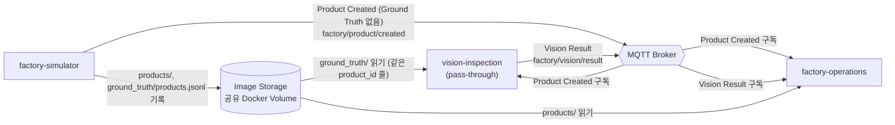
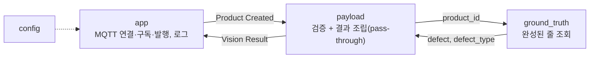
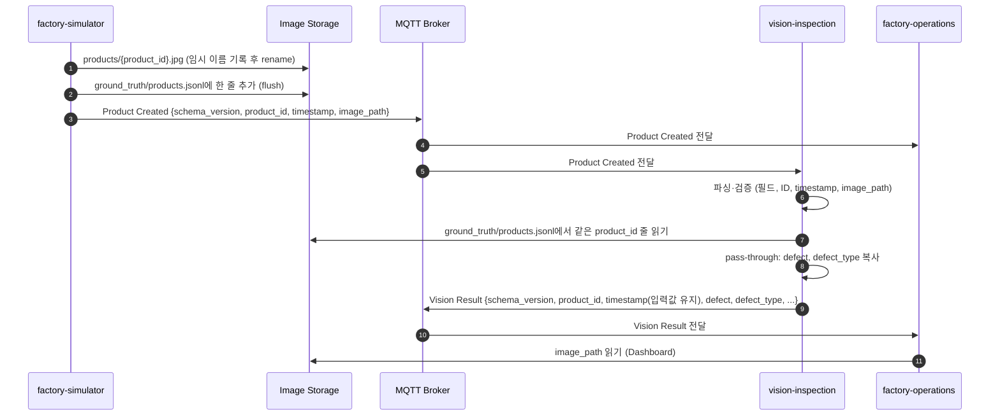

# Vision Quality Inspection 아키텍처 (초안)

> - 상태: **초안**, Codex 아키텍처 리뷰 반영(2026-09-27, `docs/reviews/architecture-codex-1.md`). 최초 작성과 범위 축소 개정 모두 2026-09-24
> - **2026-09-27 리뷰 반영**: 1~4, 6~11절의 계약 매핑을 Shared `d0c997c97129141d9853a42ce6e0d1f8f7309ae9` 확정본(Product Created, Vision Result, Ground Truth, Image Reference, CONVENTIONS)에 맞췄다. 구현자가 정해야 했던 빈 곳(Ground Truth 조회 방식, 중복 줄, `image_path` 검사, MQTT 연결, 설정 키, 로그 형식, 검증 방식)을 정했고, 모듈 구조와 판정 교체 경계를 줄였다. 아래 이력 문단들은 당시 상태 기록으로 남긴다. `contract_ref`는 아직 null이며 SHARED-5에서 이 commit으로 채택한다.
> - **범위 축소 결정 (2026-09-24, 사용자 결정)**: 이번 프로젝트에서 vision-inspection은 **AI 모델 판정을 하지 않는다**. YOLOv8/EfficientDet 결함 검출, Grad-CAM, 학습·평가가 모두 빠진다. 사용자가 말한 "VLM 판정 제외"는 이 AI 판정 전체를 뜻한다고 사용자가 확인했다(U-13 [결정]). 대신 Simulator가 제품의 불량 여부와 결함 정보를 보내고, 이 Component는 그 값을 **그대로(pass-through)** 검사 결과로 만들어 발행한다. 판정을 뺀 나머지(입력 수신·검증, 이미지 참조, ID·Timestamp, 결과 발행, 다운스트림 인터페이스 유지, 오류 처리, 관측성, 실행 형태)는 원래대로 설계한다.
> - **후속 사용자 결정 (2026-09-24)**: 구현은 Shared 승인 뒤에 한다. Shared 제기는 이 저장소가 한다(U-12). 실제 모델 판정으로 되돌릴지는 미정이다(U-10). 불량 정보를 Product Created와 분리해 별도 Topic으로 받는 방향을 제안 입장으로 했다(Q-20 (b)). 이 입장은 2026-09-27 D-6 재결정으로 폐기되었다(아래). Shared 승인 전까지는 모두 **제안**이다.
> - **Shared 제기 관련 사용자 결정 (2026-09-24, D-1~D-12)**: 범위 축소는 **과제 출제자의 승인을 받았다**(A§16의 Simulator 변경 선례와 같은 근거). 계약 변경 승인 책임자는 사용자 본인이다(A§19와 Shared CODEOWNERS 반영은 Shared 쪽 변경이므로 이슈에 담는다). 제기 방식, 입력·출력 필드 처리, 이슈 구성은 11.3절과 11.7절에 적었다.
> - 이 결정은 Shared 계약(A§2, §4.3, §8, §17, §19.1, I:Interface 후보, I:Image Reference)과 충돌하거나 계약 변경을 요구한다. 해당 항목은 11.1절 "Shared 제기 필요"에 모았다. 다른 저장소와 shared-repository는 수정하지 않았다.
> - 참고한 Shared 기준: `dltndn-personal-project/smart-factory-shared-repository`의 `main` 브랜치 commit `6bcd2aad8e374a7e96f816051585a49cb5e30f86` (2026-09-24T02:11:37Z). 읽은 문서는 `docs/ARCHITECTURE.md`, `docs/INTERFACES.md`, `docs/CONVENTIONS.md`
> - `SHARED_CONFIG.json`의 `contract_ref`가 `null`(계약 미채택)이라서 위 commit은 **참고용으로만** 읽었다(`agent/core/process/90-shared.md` 2절 방식). 이 문서의 계약 매핑은 구현 기준이 아니다.
> - **2026-09-27 갱신**: Shared `main`이 `8b1efb06325f711814152f4867d86e4413b4a404`로 바뀌었다. I-1·I-4 게시, 승인 책임자 @dltndn 지정(ISSUE-95d74411), factory-simulator 계약 반영(ISSUE-9f81b8ac, ISSUE-fde005ee)이 merge되었다. 이 변경으로 Product Created에는 결함 정보가 없고(`schema_version` 1, 밀리초 timestamp), runtime Ground Truth는 `ground_truth/products.jsonl`에 두되 평가·검증 전용이며 MQTT로 전달하지 않는다. 그래서 4.2절의 별도 Topic 제안(D-6)은 다시 결정해야 했다(아래 D-6 재결정). 범위 축소와 Vision Result를 담은 첫 DOCUMENT_CHANGE 초안(`ISSUE-e156d982…`, Shared PR #5)은 merge되지 않고 닫혔다. 이 문서의 3~4절 계약 매핑은 아직 `6bcd2aad` 기준이며, 계약 채택(SHARED-5) 때 다시 맞춘다.
> - **D-6 재결정 (사용자, 2026-09-27)**: 불량 정보 경로는 (b)로 한다. Vision은 Product Created를 받은 뒤 `ground_truth/products.jsonl`에서 같은 `product_id` 줄을 읽어 `defect`, `defect_type`을 얻는다. factory-simulator 구현은 바꾸지 않고, Ground Truth 사용 목적에 Vision pass-through 예외를 추가한다. 별도 MQTT Topic 안은 폐기했다. Shared PR #5는 사용자가 닫았고, 범위 축소·입력 경로·Vision Result를 한 DOCUMENT_CHANGE `ISSUE-c8fad59b-796c-42aa-b969-be0be65eae43`(Shared PR #6)로 다시 올렸고, 2026-09-26T16:08:12Z에 merge되었다(Shared merge commit `d0c997c97129141d9853a42ce6e0d1f8f7309ae9`). 이 문서의 3~4절 계약 매핑은 SHARED-5(contract_ref 채택) 때 `d0c997c` 기준으로 맞춘다. 1.5, 2, 3, 4.1, 4.2, 4.4, 5.1, 6.1, 9절은 이 결정으로 고쳤다.
> - **contract_ref 채택 (SHARED-5)**: 2026-09-27 Shared d0c997c97129141d9853a42ce6e0d1f8f7309ae9를 contract_ref로 채택했다(`SHARED_CONFIG.json`, `90-shared.md` 1절). 채택 전에 이 commit의 INTERFACES(Product Created, Vision Result, Image Reference, Ground Truth)·CONVENTIONS·ARCHITECTURE 4.3절 현재 범위를 원격으로 읽어 `docs/spec/AGREEMENTS.md` 요약과 다르지 않음을 확인했다(Shared main도 같은 commit). 위 이력 문단의 "아직 null"은 당시 기록이다. 이후 구현 task는 이 contract_ref로 Shared 문서를 읽는다(spec D-05).

## 0. 문서 안내

### 0.1 표기

| 표기 | 뜻 |
|---|---|
| `A§n` | Shared `docs/ARCHITECTURE.md`의 n절 |
| `I:<절 이름>` | Shared `docs/INTERFACES.md`의 해당 절 |
| `C:<절 이름>` | Shared `docs/CONVENTIONS.md`의 해당 절 |
| **[근거]** | Shared 문서에 명시된 내용. 2026-09-27 리뷰 이후 1~4, 6~10절은 `d0c997c` 확정본 기준이다(`contract_ref`는 null이며 SHARED-5에서 이 commit으로 채택한다) |
| **[가정]** | Shared에 근거가 없어 이 문서가 임시로 세운 작업 가정. 확정이 아니다 |
| **[미정]** | 결정이 필요하다. 11절의 ID(`Q-n` Shared, `L-n` 내부, `U-n` 사용자, `R-n` 조사)와 연결된다 |
| **[결정]** | 사용자가 결정했다(날짜 병기). Shared 계약 변경이 필요한 결정은 이 저장소의 제안 입장이며 Shared 승인 전까지 확정이 아니다 |
| **[제안]** | 이 저장소가 Shared에 제기할 제안 내용이다. 제안은 모두 Shared PR #6으로 처리되어 2026-09-27 리뷰 뒤 본문에서는 쓰지 않는다(이력 문단·11.7절에만 남는다) |
| **[범위 제외]** | 2026-09-24 범위 축소 결정으로 이번 프로젝트에서 하지 않는다 |
| **[충돌]** | 범위 축소 결정이 Shared 문서와 어긋난다. Shared PR #6으로 모두 해소되어 2026-09-27 리뷰 뒤 본문에서는 쓰지 않는다 |

### 0.2 다른 문서와의 관계

- `docs/COMPONENT.md`는 Agent 절차가 참조하는 도메인 슬롯이며 아직 `<미정>` 상태다(BOOT-1 대상). plan 단계에서 BOOT-1로 이 문서와 spec의 확정 사항(pass-through 책임, 입력 파일, 출력 Topic, 읽기 전용 볼륨, 실행·검증 조건)을 요약해 옮긴다. 모델 구조나 평가 데이터셋은 옮기지 않는다.
- 현재 저장소에는 코드와 실행 설정이 없다. `agent/config.yaml`의 `verify`도 비어 있다. 2절 이후의 모듈 구조와 기술 스택은 **제안**이며 spec에서 고정한다.

### 0.3 범위 축소로 바뀐 것

| 원래 설계 (Shared 기준) | 이번 범위 | 이 문서의 위치 |
|---|---|---|
| YOLOv8/EfficientDet 결함 검출 (A§4.3) | [범위 제외]. 입력의 불량 여부를 그대로 옮기는 pass-through로 대체한다 | 5절 |
| Grad-CAM 생성과 `gradcam/` 기록 (A§4.3, A§17, I:Image Reference) | [범위 제외] | 4.3, 4.4, 6.1절 |
| 전처리 (A§4.3 Preprocessing) | [범위 제외]. 이미지를 디코딩하지 않는다 | 3.2절 |
| 학습·평가 Offline 모듈, 모델 수명주기 | [범위 제외] | 5.2절 |
| mAP@0.5 ≥ 0.80, 20 FPS (A§2) | [범위 제외]. 과제 출제자 승인을 근거로 제외한다 [결정]. Shared A§2에 "현재 범위 제외"로 반영됨 | 8절, Q-23 |
| 모델·GPU 관련 기술 스택 | [범위 제외] | 7절 |
| 입력 수신·검증, 이미지 참조, ID·Timestamp, 결과 발행, 오류 처리, 관측성, 실행 형태 | 유지 | 2~4, 6, 9, 10절 |

---

## 1. 책임 범위와 경계

### 1.1 역할

- Shared 기준 역할 [근거]: 제품 이미지를 분석해 품질 상태를 추론한다. Product Image를 Quality Information으로 바꾼다(A§4.3, "Quality Intelligence" A§18).
- 이번 범위의 역할 [범위 제외 반영]: Simulator가 `ground_truth/products.jsonl`에 기록한 불량 여부와 결함 유형을 **검증하여 Vision Result 형식으로 발행하는 중계**를 맡는다. 시스템 데이터 흐름(A§7.2)에서 Vision 자리를 지키고, factory-operations가 기대하는 Vision Result 인터페이스를 유지하는 것이 목적이다. 이 변경은 Shared A§4.3 "현재 범위"로 확정되었다(Q-19 해소, Shared PR #6).

### 1.2 책임

| 책임 | 내용 | 출처 | 상태 |
|---|---|---|---|
| 입력 수신·검증 | Product Created를 구독하고 필드와 형식을 검증한다 | A§7.2, I:Product Created, C:ID, C:Timestamp | 유지 |
| Ground Truth 조회 | `ground_truth/products.jsonl`에서 같은 `product_id` 줄을 읽어 `defect`, `defect_type`을 얻는다(읽기 전용) | I:Ground Truth, I:Vision Result | [근거] 현재 범위 예외 (Shared PR #6) |
| 이미지 참조 처리 | `image_path`가 `products/{product_id}.jpg`인지 문자열로 확인하고 결과에 그대로 싣는다. 파일은 열지 않는다 | I:Image Reference | 유지 (L-7 해소: 존재 확인 안 함) |
| 판정 | Ground Truth 줄의 불량 여부와 결함 유형을 그대로 결과로 옮긴다 (pass-through) | A§4.3 현재 범위, I:Vision Result | [근거] (Q-19, Q-20 해소) |
| Inspection Result 발행 | 결과를 MQTT로 factory-operations에 보낸다 | A§4.3 Output, A§7.2 | 유지 |
| Timestamp 유지 | 입력 이벤트의 timestamp를 바꾸지 않고 결과에 싣는다 | A§17, C:Timestamp | 유지 |
| Defect Detection (AI) | 모델 추론으로 결함을 검출한다 | A§4.3, A§17 | [범위 제외] |
| Grad-CAM | 검출 근거를 시각화한다 | A§4.3, A§17 | [범위 제외] |
| 모델 지표 산출 | mAP@0.5를 측정한다 | A§2, A§19.1 | [범위 제외] |

### 1.3 하지 않는 것

Shared 기준으로 하지 않는 일 [근거]:

| 하지 않는 일 | 담당 | 출처 |
|---|---|---|
| 진동 분석, Health Index 계산, 설비 상태 결정 | predictive-maintenance | A§4.3 Out of Scope, A§17 |
| Fault Level 판단·조작 | factory-simulator | A§4.3 Out of Scope, A§4.1 |
| 컨베이어 제어, 라인 정지 판단 | factory-operations (판단), factory-simulator (물리 정지) | A§4.3 Out of Scope, A§4.4, A§17 |
| 전체 불량률 관리, 설비-품질 상관분석, Dashboard, Alarm | factory-operations | A§4.3 Out of Scope, A§4.4, A§17 |
| 데이터베이스 접근·기록과 DDL. Inspection History는 Operations가 MQTT 결과를 받아 기록한다 | factory-operations | A§4.4 Data Persistence, A§5.3, A§17 |
| 제품 이미지 생성과 `products/` 기록 | factory-simulator | A§4.1, I:Image Reference |
| Ground Truth(불량 여부·결함 유형) 생성 | factory-simulator | A§3.4, A§8 |
| Image Storage 볼륨과 공통 인프라 실행 정의 | integration | A§19.1, I:Image Reference |
| Production 수준 요구(고가용성, 확장성, Retry·복구, 멱등성, 보안, 백업) | 범위 제외 | A§2, A§12, A§13 |

이번 범위에서 추가로 하지 않는 일 [범위 제외]:

- 이미지 디코딩, 전처리, 모델 추론, Grad-CAM, 학습·평가
- 입력의 불량 여부를 고치거나 보정하는 일. 받은 값이 틀려도 바로잡지 않는다. 형식 오류만 걸러 낸다(9절)

### 1.4 소유 데이터·자원

| 자원 | 내용 | 상태 |
|---|---|---|
| `gradcam/` 디렉터리 | Shared상 Vision만 기록하는 곳이다. 디렉터리는 유지하되 이번 범위에서는 기록하지 않아 비어 있다 | [근거] I:Image Reference, [결정] D-10, Q-25 |
| 모델 가중치, 학습 코드, 평가 결과 | 없음 | [범위 제외] |
| 실행 설정 (Broker URL, Topic, `IMAGE_ROOT` 등) | 환경 변수로 둔다. 키와 기본값은 4.8절 | [근거] A§14 |
| 영속 저장소 | 소유하지 않는다. 결과의 영속 기록은 factory-operations의 DB가 맡는다 | [근거] A§4.4 Data Persistence. 로컬 기록이 필요한지는 [미정] U-11 |

### 1.5 시스템 맥락



근거: A§3.3, A§7.2, I:Product Created, I:Ground Truth, I:Image Reference(Shared `d0c997c`). Vision이 `ground_truth/products.jsonl`을 판정값 전달 목적으로 읽는 것은 Ground Truth 규칙의 현재 범위 예외로 확정되었다(Shared PR #6, [결정] D-6 재결정). Ground Truth 파일은 MQTT로 전달하지 않는다(A§8). Vision은 `products/`의 이미지 파일을 열지 않고 경로 문자열만 옮긴다. Vision이 `gradcam/`에 기록하는 경로는 이번 범위에서 없다.

---

## 2. 내부 구성요소 [가정]

Shared의 처리 순서(A§4.3 Processing Pipeline, A§7.2)에서 추론·설명 단계를 pass-through로 바꾼 구조다. 하는 일이 "수신 → 검증 → 한 줄 조회 → 조립 → 발행" 하나뿐이고 제품은 2초에 1개(분당 30개)라서, 모듈은 작은 파일 몇 개의 함수로 둔다. 모듈 구분은 이 문서의 제안이며 spec에서 고정한다.

### 2.1 Runtime 모듈

| 모듈 | 책임 | 관련 근거 |
|---|---|---|
| `config` | 환경 변수(4.8절)를 읽어 설정 객체를 만든다. 잘못된 값이면 시작 때 종료한다 | A§14, C:실행 환경과 설정 |
| `payload` | Product Created 파싱·검증(필드, `schema_version`, `product_id`, timestamp, `image_path`)과 Vision Result 조립. pass-through 판정(`defect`, `defect_type` 복사, 모델 산출 필드 `null`, `judgement_source: "PASS_THROUGH"`)도 여기서 한다 | I:Product Created, I:Vision Result, C:ID, C:Timestamp, C:Payload |
| `ground_truth` | `ground_truth/products.jsonl`에서 같은 `product_id`의 완성된 줄을 찾아 `defect`, `defect_type`을 돌려준다. 규칙은 4.2절 | I:Ground Truth, I:Vision Result |
| `app` (MQTT) | 연결·구독·발행과 메시지 처리 순서, 구조화 로그. 연결 규칙은 4.9절, 로그는 10절 | 4.1, 4.9, 10절 |
| `main` | 설정을 읽고 `app`을 실행한다 | - |

- 판정 교체 경계(플러그인, `Judge` 인터페이스)는 두지 않는다. 모델 판정으로 돌아가는 것은 Shared에서 새 DOCUMENT_CHANGE로 정할 일이며(A§4.3 현재 범위), 그때 필요한 구조를 새로 설계한다(L-8 삭제).
- [범위 제외]: 전처리, 검출, 후처리, Grad-CAM 기록, Offline 학습·평가.

### 2.2 구성도



### 2.3 디렉터리 구조 제안 [가정]

COMPONENT.md의 "구조" 슬롯과 task `scope` glob의 기준이 될 초안이다. spec에서 확정한다.

```text
src/vision_inspection/
  config.py  payload.py  ground_truth.py  app.py  main.py
tests/
Dockerfile
compose.yaml         # 이 Component 단독 확인용(4.8, 6.3절). 시스템 compose는 integration 소유
.env.example         # 실제 값이 든 .env는 commit하지 않는다(C:실행 환경과 설정)
```

---

## 3. 데이터 흐름

### 3.1 한 제품의 처리 순서



근거: A§7.2, A§4.3 현재 범위, I:Product Created(발행 전제: 이미지와 Ground Truth 기록이 끝난 뒤 발행), I:Vision Result, I:Ground Truth, I:Image Reference. factory-simulator의 실제 순서는 이미지 rename → Ground Truth 한 줄 쓰기·flush → Product Created 발행이며, Ground Truth 쓰기가 실패하면 발행하지 않는다(simulator `docs/spec/04-products.md` 7·8절, AGREEMENTS A-06·A-08).

- Product Created 발행 전에 Ground Truth 줄 기록이 끝나므로, Vision이 Product Created를 받았을 때 그 줄은 이미 있다. 그래서 대기·재시도 정책은 두지 않는다. [근거] I:Product Created 발행 전제, I:Vision Result 발행 전제
- 읽는 쪽은 `\n`으로 끝나지 않은 마지막 줄을 무시한다. [근거] I:Ground Truth
- Shared A§7.2 흐름과 비교하면 "Image Retrieval"은 Ground Truth 줄 조회로 바뀌었고, "Inference"는 pass-through로 바뀌었으며, "Grad-CAM"은 빠졌다(A§7.2 현재 범위 문단과 같다).

### 3.2 단계별 설명

| 단계 | 입력 → 출력 | 비고 |
|---|---|---|
| 1. 수신 | Product Created → 파싱된 이벤트 | 이미지 자체는 MQTT로 받지 않는다 [근거] A§3.3, A§5.4 |
| 2. 검증 | 이벤트 → 검증된 이벤트 또는 거부 | 규칙은 4.2절, 실패 시 동작은 9절. `image_path`는 문자열만 검사하고 파일을 열지 않는다 |
| 3. Ground Truth 조회 | `product_id` → `defect`, `defect_type` | 규칙은 4.2절. 줄이 없거나 읽지 못하면 발행하지 않는다(9절) |
| 4. 결과 조립 | 입력 필드, 조회한 불량 정보 → Vision Result | pass-through. 모델 산출 필드는 `null` [근거] I:Vision Result |
| 5. 발행 | Vision Result → MQTT | timestamp는 Product Created 값을 그대로 쓴다 [근거] C:Timestamp |
| (제외) 전처리, 추론, Grad-CAM | - | [범위 제외] |

---

## 4. 외부 인터페이스와 Shared 계약 매핑

Shared `d0c997c`에서 이 Component가 쓰는 Interface(Product Created, Vision Result)와 파일 Interface(Ground Truth, Image Reference)는 모두 **확정**이다(I 첫 문단, Shared PR #6). 아래 표가 그 확정본의 요약이며, 다르면 Shared가 기준이다. 이 저장소는 SHARED-5(2026-09-27)에서 이 commit(`d0c997c97129141d9853a42ce6e0d1f8f7309ae9`)을 `contract_ref`로 채택했다. 구현은 이 commit의 Shared 문서를 기준으로 한다.

### 4.1 MQTT Topic

| 방향 | Interface | Topic | 상대 | QoS / retain | 출처 (Shared `d0c997c`) |
|---|---|---|---|---|---|
| 구독 | Product Created | `factory/product/created` | 생산자 factory-simulator, 함께 소비하는 factory-operations | 1 / false | I:Interface 목록, I:Product Created |
| 발행 | Vision Result | `factory/vision/result` | 소비자 factory-operations | 1 / false | I:Interface 목록, I:Vision Result |

- Topic 이름은 코드에 하드코딩하지 않고 설정으로 받는다(기본값은 위 표). [근거] A§14, I:Interface 목록(접두사 `factory`는 설정 가능)
- 연결 세부(client id, 재연결, 재구독)는 공통 규칙이 없어 이 Component가 정한다. 4.9절.
- 사용하지 않는 Interface: Sensor Vibration, PdM Result, Alarm Event, Conveyor Control, Line Status.

### 4.2 입력: Product Created + Ground Truth 조회

**Product Created** (I:Product Created)

| 필드 | 예 | 검증 | 용도 |
|---|---|---|---|
| `schema_version` | `1` | 정수 1. 다른 값이면 거부 | 계약 버전 (C:Payload) |
| `product_id` | `P-00000113` | `^P-[0-9]{8}$` (C:ID) | Ground Truth 조회 키이자 결과 연결 키 |
| `timestamp` | `2026-09-25T05:20:13.425Z` | `^\d{4}-\d{2}-\d{2}T\d{2}:\d{2}:\d{2}\.\d{3}Z$` (C:Timestamp) | 캡처 시각. 문자열 그대로 결과에 싣는다 |
| `image_path` | `products/P-00000113.jpg` | 정확히 `products/{product_id}.jpg` | 결과에 그대로 싣는다 (I:Image Reference) |

- Payload는 UTF-8 JSON 객체 하나다. 모르는 필드는 무시한다. [근거] C:Payload
- `image_path` 검사: 생산자의 파일 이름 규칙(`products/P-XXXXXXXX.jpg`, I:Image Reference)을 그대로 쓴다. 이 규칙이면 절대 경로, `..`, 점으로 시작하는 임시 파일(`products/.P-….jpg.tmp`)이 모두 걸러진다. 이미지 파일 존재는 확인하지 않는다. 생산자가 rename으로 완성한 뒤 발행하고 Vision 판정은 이미지에 의존하지 않기 때문이다(L-7 해소).
- Product Created에는 결함 여부·유형·위치와 Fault Level이 없다. [근거] I:Product Created, A§8

**Ground Truth 조회** (I:Ground Truth 현재 범위 예외, I:Vision Result 입력과 처리)

- 파일: `IMAGE_ROOT` 아래 `ground_truth/products.jsonl`. 읽기 전용으로 연다. 기록자는 factory-simulator 하나이며 줄을 append만 한다.
- 조회 방식: 메시지마다 파일을 처음부터 끝까지 읽는다(L-10 해소). 파일은 시연 5분에 150줄·약 60 KB, 1시간이어도 1 MB 안쪽이고 제품은 2초에 1개라 충분하다. 읽은 위치 기억, 색인, 캐시는 두지 않는다.
- 완성된 줄: `\n`으로 끝난 줄만 본다. `\n`으로 끝나지 않은 마지막 줄은 무시한다. [근거] I:Ground Truth
- 줄 판별: 완성된 줄마다 JSON으로 파싱하고 `product_id`가 같은 줄을 모은다. 파싱에 실패한 줄은 건너뛰고 건수를 로그에 남긴다(한 줄이 깨졌다고 이후 모든 제품을 막지 않기 위해서다. 생산자는 쓰기 실패 시 truncate로 되돌리므로 정상이면 생기지 않는다).
- 결과 판정: 같은 `product_id` 줄이 **정확히 하나**일 때만 쓴다. 없으면 "줄 없음", 둘 이상이면 "중복 줄"로 발행하지 않는다(9절). 생산자는 발행한 번호를 같은 볼륨에서 다시 쓰지 않으므로(C:ID, simulator A-09) 중복은 파일 손상이며 어느 줄이 맞는지 추측하지 않는다.
- 사용 필드: `defect`(bool), `defect_type`(`scratch`|`dent`|`contamination`|null)만 쓴다. 나머지 필드(`bbox`, `fault_level`, `severity`, `defect_probability`, `defect_params`, `render_seed` 등)는 읽어도 쓰지 않고, 다른 필드와의 대조 검사에도 쓰지 않는다. [근거] I:Ground Truth 현재 범위 예외
- 일관성: `defect`가 bool이 아니거나, `defect: false`인데 `defect_type`이 null이 아니거나, `defect: true`인데 `defect_type`이 허용 값이 아니면 발행하지 않는다(9절). [근거] I:Ground Truth, I:Vision Result
- 시점: Product Created는 Ground Truth 기록이 끝난 뒤 발행되므로 수신 시점에 줄이 있다. 줄이 없으면 대기·재시도하지 않고 바로 로그를 남기고 미발행한다. [근거] I:Vision Result 오류, A§12
- Ground Truth 정책과의 관계: 이 읽기는 추론 입력이 아니라 판정값 전달이며, Shared가 현재 범위 예외로 명시했다(A§3.4, §8 Vision, I:Ground Truth, C:Ground Truth). Product Created 등 AI 추론 입력에 Ground Truth를 넣지 않는 규칙과 Ground Truth 파일을 MQTT로 보내지 않는 규칙은 그대로다. 모델 판정으로 돌아가면 이 예외는 없어진다.

### 4.3 출력: Vision Result (I:Vision Result 확정)

제품마다 한 번 발행한다. 모든 키를 항상 넣는다(값이 없으면 `null`).

| 필드 | 필수 | 값 (이번 범위) | 출처 |
|---|---|---|---|
| `schema_version` | 예 | `1` | C:Payload |
| `product_id` | 예 | Product Created 값 그대로 | I:Vision Result |
| `timestamp` | 예 | Product Created `timestamp` 문자열 그대로(재포맷 없음). 처리 시각 필드는 두지 않는다 | A§9, A§17, I:Vision Result |
| `defect` | 예 | Ground Truth 줄의 `defect` | I:Vision Result |
| `defect_type` | 예 | Ground Truth 줄의 `defect_type`(소문자). 양품이면 `null` | I:Vision Result, C:열거값 |
| `confidence` | 예 | 항상 `null` | I:Vision Result, [결정] D-7 |
| `bbox` | 예 | 항상 `null`. Ground Truth의 `bbox`는 옮기지 않는다 | I:Vision Result, [결정] D-8 |
| `image_path` | 예 | Product Created 값 그대로 | I:Vision Result, I:Image Reference |
| `gradcam_path` | 예 | 항상 `null` | I:Vision Result, [결정] D-7, D-10 |
| `judgement_source` | 아니오 (이 Component는 항상 넣는다) | `"PASS_THROUGH"` | I:Vision Result, [결정] D-9 |

- Vision Result에 Ground Truth의 다른 필드(`fault_level`, `severity`, `defect_probability`, `defect_params`, `render_seed`)가 들어가지 않는다. integration이 이것을 검사한다. [근거] I:Ground Truth
- 순서·중복: 재전송·중복 제거는 없다. 같은 Product Created를 두 번 받으면 결과도 두 번 나간다. 소비자는 `product_id`로 구분한다. [근거] I:Vision Result
- Operations의 Relational DB 최소 필드(A§5.3) 중 `id`와 `health_index_at_time`은 Operations가 채운다. [근거] A§4.4

### 4.4 이미지 전달 방식과 Image Storage 접근

- 이미지는 MQTT에 싣지 않는다. 경로만 보낸다. [근거] A§3.3, A§5.4
- Image Storage는 integration이 정의하는 Docker named volume 하나다. 호스트 폴더 bind mount는 쓰지 않는다. [근거] I:Image Reference, C:실행 환경과 설정
- 경로는 루트 기준 상대 경로만 받고 보낸다. 컨테이너 안 루트는 `IMAGE_ROOT`(기본 `/data`)로 받는다. [근거] I:Image Reference
- 이번 범위에서 Vision의 디렉터리 접근:

| 디렉터리 | Shared상 Vision 권한 | 이번 범위 |
|---|---|---|
| `products/` | 읽기 | 파일을 열지 않는다. 경로 문자열만 옮긴다 |
| `ground_truth/products.jsonl` | 읽기 (현재 범위 예외) | 읽기 전용으로 같은 `product_id` 줄 조회 |
| `training/`, `evaluation/` | 읽기 (학습·평가) | 사용하지 않음 [범위 제외] |
| `gradcam/` | 기록 | 기록하지 않는다. 현재 범위에서는 비어 있다 [결정] D-10 |

- 마운트: Vision은 읽기만 하므로 읽기 전용 마운트로 동작한다. I:Image Reference는 `gradcam/` 기록자인 Vision을 쓰기 권한으로 적고 있으나, 현재 범위에서는 쓰지 않으므로 실제 권한은 integration이 정한다(ISSUE-fde005ee 5항 기록과 같다). 쓰기 권한으로 마운트되어도 Vision은 쓰지 않는다.

### 4.5 Payload 검증 방식

- Shared에는 JSON Schema 파일이 없지만, 필드·타입·필수 여부는 INTERFACES 표로 확정되어 있다. 검증은 표준 라이브러리(`json`, `re`)로 직접 구현한다(L-9 해소). JSON Schema 라이브러리는 쓰지 않는다.
- 호환성은 Shared 예시 payload(Product Created, Vision Result, Ground Truth 한 줄)를 테스트 fixture로 써서 확인한다(6.3절).

### 4.6 Timestamp 정책 [근거] A§9, C:Timestamp

- 형식: UTC ISO 8601, `Z` 접미사, 밀리초 3자리 고정. 입력을 이 정규식으로 검증하고, 받은 문자열을 파싱 후 재포맷하지 않고 그대로 싣는다(A§17 "Simulator timestamp 유지").
- Vision이 만드는 timestamp는 없다. 로그의 기록 시각은 로그 레코드의 필드일 뿐 Payload에 넣지 않는다.

### 4.7 ID 정책 [근거] A§11, C:ID

- `product_id`: `^P-[0-9]{8}$`. 유일성 범위는 Image Storage 볼륨 하나의 수명이고, 번호 사이에 빈 번호가 있을 수 있다. production sequence는 `product_id`의 숫자 부분이며 별도 필드를 두지 않는다. Vision은 순서나 빈 번호를 검사하지 않는다.
- `sensor_id`는 쓰지 않는다.

### 4.8 설정 항목 [근거] A§14, C:실행 환경과 설정

환경 변수로 받는다. 이름은 factory-simulator(`MQTT_URL`, `IMAGE_ROOT`, simulator `docs/spec/09-runtime.md`)와 맞췄다. 기본값은 컨테이너 기준이다.

| 환경 변수 | 기본값 | 뜻 |
|---|---|---|
| `MQTT_URL` | `mqtt://mosquitto:1883` | Broker 주소. `mqtt://host:port`만 받는다(인증·TLS 없음, A§13) |
| `MQTT_CLIENT_ID` | `vision-inspection` | 4.9절 |
| `PRODUCT_CREATED_TOPIC` | `factory/product/created` | 구독 Topic |
| `VISION_RESULT_TOPIC` | `factory/vision/result` | 발행 Topic |
| `IMAGE_ROOT` | `/data` | Image Storage 루트. Ground Truth 파일은 `IMAGE_ROOT/ground_truth/products.jsonl` |
| `LOG_LEVEL` | `INFO` | 로그 수준 |

- 실제 값이 든 `.env`는 commit하지 않고 `.env.example`만 둔다. Shared가 예로 든 Model Path, Threshold는 쓰지 않는다.
- 설정 값이 잘못되면(`MQTT_URL` 형식 오류 등) 시작 때 오류 로그를 남기고 종료한다. `IMAGE_ROOT`나 Ground Truth 파일이 아직 없는 것은 설정 오류가 아니다(simulator가 나중에 만든다). 메시지 처리 때 "파일 읽기 실패"로 다룬다.

### 4.9 MQTT 연결 [가정]

- MQTT 3.1.1, clean session, keepalive 30초, 인증·TLS 없음. factory-simulator와 같다(I:Interface 목록). 인스턴스는 하나이므로 client id는 고정값 `vision-inspection`(설정 가능)을 쓴다.
- 구독은 연결될 때마다(연결 성공 콜백에서) 다시 한다. clean session이라 재연결 뒤 구독이 사라지기 때문이다.
- 재연결은 클라이언트 라이브러리의 자동 재연결을 쓴다. 끊긴 동안 발행된 Product Created와 구독 전(시작 전)에 발행된 메시지는 받지 못하며, 되찾지 않는다(retain false, A§12).
- 발행은 QoS 1이다. 발행 호출이 실패하면 오류 로그를 남기고 그 결과는 버린다. 재발행 큐는 두지 않는다. Broker의 PUBACK을 받으면 `published` 로그를 남긴다(10절). 발행 요청과 발행 완료를 로그에서 구분하기 위해서다.
- 구체적인 라이브러리 API(paho-mqtt 2.x의 콜백 버전, 자동 재연결 설정)는 spec에서 확인해 고정한다(R-9).

---

## 5. 판정 단계와 모델 수명주기

### 5.1 Pass-through 판정

- 동작: Ground Truth 줄의 `defect`, `defect_type`을 Vision Result에 복사한다. 값을 바꾸거나 추정하지 않는다. `bbox`는 옮기지 않는다([결정] D-8, I:Vision Result).
- 별도 판정 모듈이나 교체 경계는 두지 않는다(2.1절). 모델 판정 복귀 여부는 [미정] U-10이며, 복귀하면 Shared DOCUMENT_CHANGE와 함께 다시 설계한다(A§4.3 현재 범위, A§8 "모델 판정으로 돌아가면 이 예외는 없어진다").

### 5.2 모델 수명주기 [범위 제외]

학습 데이터, 모델 선택(YOLOv8/EfficientDet), 평가(mAP@0.5), 버전, 가중치 보관, 배포, Grad-CAM 적용 방식은 모두 이번 범위에서 제외한다(A§4.3 현재 범위). factory-simulator는 Vision 학습·평가 데이터셋을 만들지 않으며 `training/`·`evaluation/`에 쓰지 않는다(I:Image Reference, ISSUE-fde005ee).

---

## 6. 저장소·상태 관리와 실행 형태

### 6.1 저장소와 상태

| 대상 | 접근 | 상태 |
|---|---|---|
| Image Storage `products/` | 접근하지 않음 (경로 문자열만) | 4.2절 |
| Image Storage `ground_truth/products.jsonl` | 읽기 전용 조회 | [근거] I:Ground Truth 현재 범위 예외 |
| Image Storage `training/`, `evaluation/`, `gradcam/` | 접근하지 않음 | [범위 제외] |
| TimescaleDB, PostgreSQL | 접근하지 않음. 검사 결과의 영속 기록은 Operations가 Vision Result를 받아 한다 | [근거] A§4.4 Data Persistence, A§17 |
| 프로세스 내부 상태 | 설정과 MQTT 연결만 둔다. 메시지 사이에 상태(처리한 `product_id`, 파일 위치)를 두지 않는다 | [가정] |
| 로컬 기록 | 구조화 로그만 남긴다(10절). 별도 결과 파일이나 DB는 두지 않는다 | [가정] U-11 |

- 중복 메시지를 받으면 같은 결과를 다시 발행한다. 중복을 막지 않는다. [근거] A§3.2, A§12, I:Vision Result

### 6.2 실행 형태

| 항목 | 내용 | 상태 |
|---|---|---|
| 서비스 | MQTT를 구독하며 계속 실행되는 경량 프로세스 하나. 메시지는 받은 순서대로 하나씩 처리한다 | [가정] (A§3.2에서 도출) |
| 컨테이너·조합 | Docker 컨테이너(Python 3.12 기반 이미지)로 실행하고 시스템 조합은 Docker Compose다. 시스템 compose 정의와 named volume은 integration이 소유한다 | [근거] C:실행 환경과 설정, A§19.1 (Q-12, U-6 해소) |
| 하드웨어 | GPU가 필요 없다. 일반 CPU 환경이면 충분하다 | [가정] (모델 없음) |
| 인스턴스 수 | 1개 | [근거] A§2 (확장성 제외) |
| 학습·평가 실행 | 없음 | [범위 제외] |

### 6.3 로컬 실행·검증 방식 [가정]

이 맥(macOS, Python 3.12, Docker)에서 돌릴 수 있는 것만 둔다. 구체적인 명령과 `agent/config.yaml` `verify`는 spec·plan(BOOT-1)에서 실제로 실행해 본 뒤 적는다(L-6).

- 단위 테스트(호스트 Python 3.12, Broker 없이): Product Created 검증(정상, 필드 누락, `schema_version`·`product_id`·timestamp·`image_path` 위반), Ground Truth 조회(완성된 줄, 잘린 마지막 줄 무시, 줄 없음, 중복 줄, 깨진 다른 줄 건너뛰기, 일관성 위반), Vision Result 조립(모든 키, null 필드, `PASS_THROUGH`, Ground Truth 다른 필드 없음). fixture는 Shared 예시 payload와 임시 디렉터리의 JSONL 파일이다.
- 컨테이너 확인: 이 저장소의 `compose.yaml`로 Mosquitto와 Vision을 올리고, 테스트용 named volume에 Ground Truth 파일을 넣은 뒤 Product Created를 직접 발행해 Vision Result를 받는지 본다. factory-simulator 없이 돌아간다.
- simulator와의 E2E는 integration의 일이다. 참고: simulator는 브라우저 렌더러가 있어야 제품을 만들며, 자동 검증에는 simulator의 `scripts/fake_renderer.py`를 쓴다(simulator AGREEMENTS A-17).

---

## 7. 기술 스택

| 영역 | 선택 | 상태 | 근거 |
|---|---|---|---|
| 컴포넌트 간 통신 | MQTT 비동기 메시징 | [근거] | A§3.2, A§10 |
| MQTT Broker | Eclipse Mosquitto. 실행 정의는 integration | [근거] | A§5.1, A§19.1 |
| 이미지 공유 | Docker named volume, 상대 경로 | [근거] | I:Image Reference, C:실행 환경과 설정 |
| 설정 | 환경 변수, `.env` (4.8절) | [근거] | A§14, C |
| 언어 | Python 3.12 | [가정] L-1 (작업 환경 기준) | 없음 |
| MQTT 클라이언트 | paho-mqtt 2.x | [가정] L-1, R-9 | 없음 |
| Payload 검증 | 표준 라이브러리 | L-9 해소 (4.5절) | 없음 |
| 테스트 | pytest | [가정] U-8. 명령은 spec·plan에서 | 없음 |
| 컨테이너 | Docker, Docker Compose | [근거] (Q-12 해소) | C:실행 환경과 설정 |
| 검출 모델, DL 프레임워크, Grad-CAM, 이미지 처리 라이브러리, GPU 런타임 | 없음 | [범위 제외] | A§4.3 현재 범위 |

---

## 8. 비기능 요구사항

| 요구 | 기준 | 출처 | 이번 범위 |
|---|---|---|---|
| 검출 정확도 | mAP@0.5 ≥ 0.80 | A§2 | 현재 범위 제외 [근거] A§2, A§4.3 현재 범위 (Q-23 해소) |
| 추론 처리량 | 20 FPS 이상 | A§2, A§19.1 | 현재 범위 제외 [근거] A§2, A§19.1 (Q-23 해소) |
| 처리량 | Simulator의 제품 생성 속도(기본 2초에 1개, 시연 5분에 150개)를 따라갈 것 | I:Ground Truth, simulator 04-products | 파싱·파일 한 번 읽기·발행만 하므로 충분하다 [가정] |
| 결과 전달 지연 | Vision 전용 기준은 없다. Dashboard 5초 이내 갱신(A§2)은 Operations 기준이며 Vision 지연이 그 일부를 차지한다 | A§2 | 목표치를 따로 두지 않는다. 수신→발행 시간은 로그로 본다(10절) |
| 범위 제외 | 고가용성, 확장성, 성능 최적화, 보안, 암호화, 백업 | A§2, A§12, A§13 | [근거] |

---

## 9. 오류 처리

Shared 방침은 Happy Path 중심이다. 최소 수준의 오류 로그와 예외 처리만 두고 Retry, DLQ, 자동 Restart는 구현하지 않는다(A§12). 오류 응답 Topic이나 오류 결과 메시지는 없고, 잘못된 입력은 적용하지 않고 로그로 남긴다(C:오류 표현, I:Vision Result 오류. Q-15 해소). 아래 표의 "미발행" 행은 모두 [근거] I:Vision Result 오류이며, 세부 분류는 이 문서의 결정이다.

| 상황 | 동작 | 로그 `reason` |
|---|---|---|
| Product Created JSON 파싱 실패, 객체가 아님 | 미발행, 오류 로그 | `invalid_json` |
| 필수 필드 누락, 타입 오류, `schema_version` ≠ 1 | 미발행, 오류 로그 | `invalid_payload` |
| `product_id` 형식 불일치 | 미발행, 오류 로그 | `invalid_product_id` |
| timestamp 형식 불일치 | 미발행, 오류 로그 | `invalid_timestamp` |
| `image_path`가 `products/{product_id}.jpg`가 아님 | 미발행, 오류 로그 | `invalid_image_path` |
| Ground Truth 파일 없음, 권한 오류, 읽기 오류 | 미발행, 오류 로그 | `ground_truth_unreadable` |
| 같은 `product_id`의 완성된 줄 없음 | 미발행, 오류 로그. `defect: false`로 가정해 채우지 않는다(불량을 정상으로 잘못 보고하지 않기 위해). 대기·재시도하지 않는다 | `ground_truth_missing` |
| 같은 `product_id`의 완성된 줄이 둘 이상 | 미발행, 오류 로그. 어느 줄도 고르지 않는다 | `ground_truth_duplicate` |
| 찾은 줄의 `defect`·`defect_type` 불일치·허용 값 밖 | 미발행, 오류 로그 | `ground_truth_invalid` |
| Ground Truth의 다른 줄이 JSON으로 파싱되지 않음 | 그 줄만 건너뛰고 경고 로그(건수). 찾던 줄을 찾으면 발행한다 | `ground_truth_bad_lines` |
| 발행 호출 실패, Broker 연결 끊김 | 오류 로그. 그 결과는 버리고 재발행하지 않는다. 연결은 라이브러리가 자동으로 다시 맺고 재구독한다(4.9절) | `publish_failed`, `disconnected` |
| 설정 오류 (시작 시) | 오류 로그 후 프로세스 종료. 자동 재시작하지 않는다 | `invalid_config` |

원칙은 하나의 메시지 실패가 프로세스 전체를 멈추지 않게 하는 것이다. 메시지 처리 중 예상하지 못한 예외도 잡아서 오류 로그(`internal_error`)를 남기고 다음 메시지를 처리한다. [가정]

---

## 10. 관측성

Shared에는 관측성 요구가 없다. 아래는 디버깅과 E2E 확인에 필요한 최소 수준이다. [가정]

- 형식: 표준 출력에 한 줄 JSON 레코드 하나. 공통 필드는 `ts`(기록 시각, UTC 밀리초), `level`, `event`다. 오류·미발행 레코드에는 `reason`(9절)을 넣는다. `product_id`와 입력 `timestamp`는 파싱으로 알 수 있을 때만 넣는다(시작 로그, JSON 파싱 실패에는 없다).
- `event` 값: `started`(구독·발행 Topic, `IMAGE_ROOT`, 판정 방식 `PASS_THROUGH`), `connected`, `disconnected`, `received`, `dropped`(미발행, `reason` 포함), `published`(PUBACK 수신. `defect`, `defect_type`, 수신→PUBACK 시간 `latency_ms`), `error`.
- 이 로그가 이 Component의 기록이다. 영속 기록은 Operations DB가 맡는다. 주기 집계, 수집 스택(Prometheus 등)은 두지 않는다. 건수는 로그를 세어 확인한다.

---

## 11. 미결 사항

범위 축소 뒤 항목을 다시 정리했다. 기존 번호는 추적할 수 있도록 유지하고, 빠진 번호는 11.5절에 이유를 적었다.

### 11.1 Shared 질문의 처리 결과

2026-09-24에 정리한 Shared 질문은 I-1·I-4 게시와 Shared ISSUE-9f81b8ac·fde005ee·95d74411·c8fad59b(Shared PR #6, `d0c997c`)로 대부분 답이 정해졌다. 질문 원문과 당시 제안 입장은 Git 이력(이 파일의 2026-09-27 리뷰 이전 판)과 Shared Issue에 남아 있다. 이 저장소가 Shared에 더 제기할 항목은 없다.

**범위 축소로 생긴 항목**

| ID | 질문 요지 | 결과 (Shared `d0c997c`) | 반영 위치 |
|---|---|---|---|
| Q-19 | AI 판정을 빼고 pass-through로 바꾸는 것 | 해소. A§4.3 "현재 범위", A§7.2·17·18 개정. 승인 책임자 @dltndn(ISSUE-95d74411) | 1.1, 1.2, 5절 |
| Q-20 | Ground Truth 정책과의 관계 | 해소. Vision의 `ground_truth/products.jsonl` 읽기(`defect`, `defect_type`만)를 현재 범위 예외로 명시(A§3.4, §8, I:Ground Truth, C:Ground Truth) | 4.2절 |
| Q-21 | 별도 불량 정보 Topic payload | 해소. 새 Topic 없음(D-6 재결정) | - |
| Q-22 | 모델 산출 필드 처리 | 해소. `confidence`, `bbox`, `gradcam_path` 키 유지·`null`. Dashboard 항목은 비어 있음(A§4.4) | 4.3절 |
| Q-23 | Vision 성능 기준과 integration의 Vision 측정, Simulator의 Vision 학습 데이터셋 | 해소. 현재 범위 제외(A§2, §19.1). Simulator는 `training/`·`evaluation/`에 쓰지 않음 | 5.2, 8절 |
| Q-24 | 판정 출처 구분과 상관분석 해석 | 판정 출처는 해소(`judgement_source: "PASS_THROUGH"`). 상관분석 해석은 factory-operations 몫으로 남음(Vision 구현과 무관) | 4.3절 |
| Q-25 | `gradcam/`, `training/`, `evaluation/` 행 | 해소. `gradcam/` 유지·비어 있음, `training/`·`evaluation/`은 현재 범위에서 쓰지 않음(I:Image Reference) | 4.4절 |

**원래부터 있던 항목**

| ID | 질문 요지 | 결과 (Shared `d0c997c`) | 반영 위치 |
|---|---|---|---|
| Q-1 | Topic과 계약 버전 | 해소. 두 Topic 확정, `schema_version` 1 | 4.1절 |
| Q-2 | 필드·타입, `defect_type` 표기 | 해소. INTERFACES 표, 결함 유형 소문자(C:열거값) | 4.2, 4.3절 |
| Q-3 | 결함이 여럿이거나 없을 때 | 해소. 제품당 `defect_type` 하나(string\|null), 양품 null | 4.3절 |
| Q-5 | `bbox` 좌표계 | 해소. `[x_min, y_min, x_max, y_max]` px(C:이미지 좌표). 이번 범위에서는 `null` | 4.3절 |
| Q-6 | 결과 timestamp와 처리 시각 필드 | 해소. 입력 timestamp 유지, 처리 시각 필드 없음 | 4.3, 4.6절 |
| Q-7 | QoS·retain·client id | QoS·retain 해소(Interface별). client id 공통 규칙은 없어 이 Component가 정함 | 4.1, 4.9절 |
| Q-9 | `product_id` 유일성, production sequence | 해소(C:ID) | 4.7절 |
| Q-11 | A§5.4 "Inspection Image" | 답 없음. 이번 범위에서 Vision은 이미지를 만들지 않아 구현에 필요 없음 | - |
| Q-12 | 공통 실행 방식 | 해소. Docker Compose, named volume(C:실행 환경과 설정) | 6.2절 |
| Q-14 | 생산 속도와 지연 목표 | 생산 속도 해소(2초에 1개, 시연 5분 150개). 지연 목표는 없음. Vision 구현에 필요 없음 | 8절 |
| Q-15 | 처리 실패 표현 | 해소. 오류 결과 없이 로그만(C:오류 표현, I:Vision Result) | 9절 |
| Q-17 | A§6 그림 문구 | 답 없음. 명확화 요청일 뿐 구현에 필요 없음 | - |
| Q-18 | A§5.3 Vision 최소 필드의 `defect` | factory-operations의 기록 범위. Vision 구현과 무관 | - |

### 11.2 Component 내부 결정

| ID | 항목 | 결과 |
|---|---|---|
| L-1 | 언어와 MQTT 라이브러리 | Python 3.12, paho-mqtt 2.x로 둔다(작업 환경 기준 [가정]). 버전 고정과 API 확인은 spec(R-9) |
| L-6 | 검증 명령(test, lint)과 `agent/config.yaml` `verify` | 방식은 6.3절. 명령은 spec·plan에서 실제로 실행해 본 뒤 BOOT-1로 적는다 |
| L-7 | 이미지 파일 존재 확인 | 해소(2026-09-27 리뷰). 확인하지 않는다. `image_path`는 문자열만 검사한다(4.2절) |
| L-8 | `judge` 경계의 형태 | 삭제(2026-09-27 리뷰). 교체 경계를 두지 않는다(2.1, 5.1절) |
| L-9 | Payload 검증 방식 | 해소(2026-09-27 리뷰). 표준 라이브러리로 직접 구현(4.5절) |
| L-10 | Ground Truth 줄 조회 방식 | 해소(2026-09-27 리뷰). 메시지마다 처음부터 읽고, 같은 `product_id` 완성 줄이 정확히 하나일 때만 쓴다(4.2절) |

### 11.3 사용자 확인

**결정됨**

| ID | 질문 | 결정 (사용자, 2026-09-24) | 반영 위치 |
|---|---|---|---|
| U-13 | "VLM 제외"가 AI 모델 판정 전체를 뜻하는가? | [결정] 그렇다. YOLOv8/EfficientDet 검출, Grad-CAM, 학습·평가를 모두 뺀다 | 문서 상단, 0.3절 |
| U-12 | 구현 착수 시점과 Shared 제기 주체 | [결정] Shared 승인 뒤에 구현한다. Shared 제기는 이 vision-inspection 저장소가 한다 | 문서 상단, 11.6절 |
| U-10 | 나중에 실제 모델 판정으로 되돌리는가? | [결정] 되돌릴지는 **미정**이다. 불량 정보를 별도 Topic으로 분리하는 방향(Q-20 (b))에는 동의했으나, 2026-09-27 D-6 재결정으로 Ground Truth 파일 읽기로 바뀌었다 | 4.2절, 5.1절, Q-20. 판정 교체 경계는 두지 않는다(2026-09-27 리뷰) |

**Shared 제기 관련 결정 (사용자, 2026-09-24)**

| ID | 결정할 질문 | [결정] | 관련 Q | 반영 위치 |
|---|---|---|---|---|
| D-1 | 계약 변경 승인 책임자 | 사용자 본인. A§19와 Shared CODEOWNERS 반영은 Shared 쪽 변경이라 이 저장소에서 고치지 않고 I-1에 담는다 | Q-19 | 11.1, 11.7절 |
| D-2 | 과제 평가 기준과의 관계 | 과제 출제자 승인을 이미 받았다. A§16 선례처럼 "출제자 승인"을 범위 축소의 근거로 기록한다 | Q-19, Q-23 | 문서 상단, 0.3절, 8절 |
| D-3 | 제기 유형과 순서 | MESSAGE로 먼저 합의하고, 합의 뒤 DOCUMENT_CHANGE를 올린다. **2026-09-27 사용자 지시로 변경:** I-1·I-4 게시 뒤에는 이슈와 공용 문서 수정을 같은 PR에 넣는 DOCUMENT_CHANGE로 바로 올린다 | Q-19~Q-25 | 11.7절 |
| D-4 | 이슈 단위 | I-1(범위·성능), I-2(입력·Ground Truth), I-3(출력·다운스트림) 3건. I-1을 먼저 게시한다 | Q-19~Q-25 | 11.7절 |
| D-5 | `source.task`와 근거 문서 | PLAN에 Shared 제기 task를 추가하고(`proposed: true`), 이 문서를 근거 문서로 삼는다 | - | `agent/PLAN.yaml` M1, 11.7절 |
| D-6 | 불량 정보 Topic의 메시지 형태 | (폐기, 2026-09-27 D-6 재결정으로 대체) 자기완결형. Topic 이름은 Shared에 맡긴다. factory-operations는 구독하지 않는다 | Q-20, Q-21, Q-1 | 4.2절 |
| D-6 재결정 | Vision이 불량 정보를 받는 경로 (2026-09-27) | **[결정] (b)** (사용자, 2026-09-27). Product Created를 받은 뒤 `ground_truth/products.jsonl`에서 같은 `product_id` 줄을 읽어 `defect`, `defect_type`을 얻는다. factory-simulator 구현은 바꾸지 않고 Ground Truth 사용 목적에 Vision pass-through 예외를 추가한다. 별도 MQTT Topic 안(D-6 원안)은 폐기한다 | Q-20, Q-21 | 4.2절, Shared PR #6 |
| D-7 | 모델 산출 필드 | `confidence`, `gradcam_path`는 키를 유지하고 값은 `null` | Q-22 | 4.3절 |
| D-8 | `bbox` 제공 | `null`. Simulator에 결함 위치를 요구하지 않는다 | Q-21, Q-22, Q-5 | 4.2, 4.3절 |
| D-9 | 판정 출처 표시 | 선택 필드 `judgement_source`. 값은 CONVENTIONS 열거값 대문자 규칙(ISSUE-9f81b8ac)에 따라 `"PASS_THROUGH"` | Q-24 | 4.3절 |
| D-10 | `gradcam/`과 Dashboard의 Grad-CAM 항목 | 둘 다 유지하고 "이번 범위에서는 비어 있음"으로 표시 | Q-22, Q-25 | 1.4, 4.3, 4.4절 |
| D-11 | 범위 축소의 표현 | "현재 범위 제외, 복귀는 새 DOCUMENT_CHANGE로 제안". DOCUMENT_CHANGE에서는 `change.after`와 `compatibility`에 적는다. `transition.rollback`에는 A§19 복구 방법(마지막으로 검증된 Component 조합과 계약 commit으로 되돌림)을 적는다 (2026-09-25 수정) | Q-19, Q-23, Q-25 | 11.7절 |
| D-12 | 기존 명확화 질문 | MESSAGE 1건(I-4)으로 묶는다 | Q-6, 7, 9, 11, 12, 14, 15, 17 | 11.7절 |

**남은 확인 항목 (우선순위 순)**

| ID | 확인할 것 | 필요한 이유와 영향 | 답이 없을 때 기본 가정 |
|---|---|---|---|
| U-6 | 실행 방식: Docker를 반드시 쓰는가, 로컬 개발 흐름은? | 해소. Shared CONVENTIONS가 Docker Compose·named volume으로 정했다. 단위 테스트는 호스트 Python 3.12에서 돌린다(6.2, 6.3절) | - |
| U-5 | 언어 제약이나 팀이 익숙한 스택이 있는가? | 7절, 2.3절, L-1 | Python 3.12(작업 환경), paho-mqtt 2.x |
| U-8 | 테스트·lint 도구와 CI 검증 범위 | L-6, BOOT-1, 6.3절 | pytest. lint 도입 여부는 spec에서 정한다 |
| U-11 | Vision이 발행한 결과를 로컬 파일로도 남겨야 하는가? | 6.1절, 10절. 영속 기록은 Operations DB가 맡는다 | 구조화 로그만 남긴다 |
| U-9 | ARCHITECTURE.md를 COMPONENT.md와 따로 유지할지, 리뷰 담당자는 누구인지 | 0.2절 | 따로 유지하고 확정된 요약만 COMPONENT.md로 옮긴다 |

### 11.4 외부 조사 필요

| ID | 조사 질문 | 확인하려는 판단 | 추천 출처 | 영향 |
|---|---|---|---|---|
| R-9 | paho-mqtt 2.x의 API(콜백 버전), 자동 재연결 설정, 연결 콜백에서의 재구독, PUBACK 콜백 | 4.9절 연결 규칙을 구현 API로 옮기기 | paho-mqtt 공식 문서, Mosquitto 문서 | 4.9, 9절, L-1. spec 단계에서 확인 |

R-11(JSON Schema 라이브러리)은 L-9 해소로 삭제했다(2026-09-27 리뷰).

### 11.5 범위 축소로 정리한 항목

| 이전 ID | 처리 | 이유 |
|---|---|---|
| Q-4 (Grad-CAM 생성 범위·파일 형식) | Q-22, Q-25로 대체 | Grad-CAM을 만들지 않는다 |
| Q-8 (`model_version` 필드) | Q-24로 대체 | 모델이 없다. 판정 출처 구분 문제로 바뀌었다 |
| Q-10 (학습·평가 라벨 형식) | 삭제 | 학습·평가를 하지 않는다 |
| Q-13 (20 FPS 측정 구간) | Q-23으로 대체 | 성능 기준 자체의 적용 여부 문제로 바뀌었다 |
| Q-16 (모델 지표 수집 형식) | Q-23으로 대체 | 모델 지표가 없다 |
| Q-12의 GPU 부분 | 삭제 (나머지는 유지) | GPU가 필요 없다 |
| L-2 (모델 선택), L-3 (Grad-CAM 방식), L-4 (모델 버전), L-5 (가중치 보관) | 삭제 | 범위 제외 |
| U-1 (GPU·하드웨어), U-2 (mAP·FPS·Grad-CAM 우선순위), U-3 (모델·라이선스), U-4 (학습 데이터), U-7 (가중치 보관) | 삭제 | 범위 제외. 일반 실행 환경은 U-6에 남겼다 |
| R-1~R-7 (FPS 근거, 검출용 Grad-CAM, 라이선스, 정확도, mAP 도구, 라벨 형식, 구현체 유지보수) | 삭제 | 범위 제외 |
| R-8 (GPU 컨테이너, macOS MPS) | 삭제 | GPU가 필요 없다 |
| R-10 (공유 볼륨 rename 원자성) | 삭제 | Vision이 Image Storage에 기록하지 않는다 |

### 11.6 이 저장소 절차상 남은 일

- 필요한 계약 변경(Q-19~Q-25)은 Shared PR #6(`d0c997c`)으로 merge되었다. 구현 전에 SHARED-5(2026-09-27)에서 `d0c997c`를 `contract_ref`로 채택했다(`90-shared.md` 1절). 4절 매핑은 2026-09-27 리뷰에서 이 commit에 맞췄고, 채택 때 다시 확인했다.
- 이 저장소가 Shared에 더 제기할 항목은 없다(11.1절). 새로 제기할 일이 생기면 `90-shared.md` 5절과 Shared `docs/SHARED_WORKFLOW.md`에 따른다.
- `docs/COMPONENT.md`의 `<미정>` 슬롯, 검증 명령, 첫 도메인 milestone은 plan 단계의 BOOT-1 task에서 다룬다(조율 결정 C-09).
- Shared Issue 6건(`d0c997c` 색인)은 SHARED-1에서 검토해 `SHARED_ISSUE_STATUS.yaml`에 기록했다(11.7절 검토 기록). `affected` 3건은 계약 채택과 구현에서 처리한다.

### 11.7 Shared 제기 계획 [결정] D-3(2026-09-27 변경), D-4, D-5, D-11, D-12

**절차 요약** (Shared `docs/SHARED_WORKFLOW.md`, `AGENTS.md`, `templates/`, `README.md`, `scripts/`. 2026-09-27에 `8b1efb0`로 다시 읽었고, 규칙 파일은 `6bcd2aad` 이후 CODEOWNERS 말고 바뀌지 않았다)

- 초기화 기간은 끝났다(첫 운영 Issue I-1·I-4 merge). 이제 `docs/` 변경은 같은 PR의 DOCUMENT_CHANGE로만 할 수 있다(`scripts/validate_shared.py`).
- DOCUMENT_CHANGE에는 `reason`, `changed_documents`, `change.before/after`, `compatibility`, `transition.adoption/rollback`을 쓰고, 실제 Shared 문서 수정과 `issues/index.json` 항목을 같은 PR에 넣는다. CODEOWNERS(@dltndn) 승인 뒤 merge된다.
- MESSAGE만 추가한 PR은 CODEOWNERS에 실제 소유자가 생겨 `auto_approval.py` 기준 자동 승인 대상이다. 다만 Shared 저장소의 "Allow auto-merge"가 꺼져 있어 CI의 자동 merge 단계는 실패한다. 사람이 merge한다(2026-09-27 확인).
- 공통 필드: `source.component: vision-inspection`, `source.task`(PLAN의 SHARED-n), `summary`, `created_at`(UTC), `attention`, `related_issues`(색인에서 앞선 Issue만).
- 게시된 Issue는 고치지 않는다. 새 사실은 새 Issue로 올린다. PR 생성은 게시 완료가 아니며 merge 여부를 확인한다.
- 다른 Component 소유 절: Shared 규칙에 금지 조항이 없고, factory-simulator의 ISSUE-9f81b8ac도 공통 절(17절 등)을 고친 선례가 있다. 다만 소유 Component의 판단이 필요한 절(A§5.3 등)은 고치지 않고 compatibility에 확인 요청으로 남긴다.

**게시 순서와 구성**

| 순서 | 이슈 | 유형 | 담은 내용 | 관련 Q | attention | 상태 |
|---|---|---|---|---|---|---|
| 1 | I-1 범위 축소와 성능 기준 | MESSAGE | 범위 축소 제안, 출제자 승인 근거, 승인 책임자 지정 요청 | Q-19, Q-23 | factory-simulator, factory-operations, integration | 게시됨 (Shared PR #1) |
| 2 | I-4 명확화 질문 모음 | MESSAGE | Q-6, 7, 9, 11, 12, 14, 15, 17 | 같음 | factory-simulator, factory-operations, integration | 게시됨 (Shared PR #1). Q-6, 7, 9, 12, 14 일부, 15는 ISSUE-9f81b8ac·fde005ee가 답했다 |
| - | (초안) 범위 축소와 Vision Result | DOCUMENT_CHANGE | ISSUE-e156d982, Shared PR #5 | - | - | 닫힘(merge 안 됨, 미게시). ID는 재사용하지 않는다 |
| 3 | DOC-1 범위 축소, Ground Truth 입력 경로, Vision Result 확정 (원래 I-1 후속 + I-2 + I-3) | DOCUMENT_CHANGE + 문서 수정 | ARCHITECTURE 2·3.4·4.3(현재 범위, 입력 경로)·4.4·7.2·8·17·18·19.1, INTERFACES Vision Result(입력·처리·오류)·Image Reference·Ground Truth 예외·integration 검사, CONVENTIONS Ground Truth | Q-19~Q-25, Q-6, Q-15 | factory-simulator, factory-operations, integration | 게시됨 (Shared PR #6, merge commit `d0c997c`) |

- **한 Issue로 올린 이유:** 입력 경로 없이 범위 축소와 Vision Result만으로는 Vision이 결과를 발행할 수 없다. 두 변경은 Shared 문서의 같은 문장(3.4·4.3·8절, INTERFACES Ground Truth, CONVENTIONS)을 고친다. 규칙은 PR 하나에 DOCUMENT_CHANGE 여러 건을 허용하지만 나누도록 요구하지는 않는다.
- DOC-1의 `change.after`와 `compatibility`에 "현재 범위 제외, 모델 판정 복귀는 새 DOCUMENT_CHANGE로 제안"(D-11)을 적었고, `transition.rollback`에는 A§19 복구 방법(`8b1efb0`으로 되돌림)을 적었다.
- `reason`에 이 저장소 `main` commit에 고정한 permalink를 넣었다(DOCUMENT_CHANGE 템플릿에는 `evidence` 필드가 없다).
- factory-operations에는 확인 요청으로만 남겼다: A§5.3 Vision 최소 필드, Ground Truth에서 옮긴 결함 값을 상관분석에 쓰는 것과 A§17 "Evaluation Only"의 관계.
- **게시 후 기록:** 게시한 Issue가 Shared `main`에 merge되면 아래 게시 기록란에 ID를 적는다. 이어서 `90-shared.md` 2·4절에 따라 색인 순서대로 검토해 `SHARED_ISSUE_STATUS.yaml`에 기록하고 `validate.py --remote`로 확인한다. Shared Issue 검토는 사용자가 요청할 때만 한다(AGENTS.md). 앞선 미검토 Issue(ISSUE-95d74411, 9f81b8ac, fde005ee)도 순서대로 함께 처리한다.

**PLAN 연결** (`agent/PLAN.yaml` milestone M1. 2026-09-27 계획 PR에서 책임자 채팅 승인으로 `proposed` 없이 등록했다. 실행 순서는 `docs/plan/`)

| task | 내용 | 담당 | 상태 |
|---|---|---|---|
| SHARED-1 | I-1, I-4 MESSAGE 게시와 게시 후 기록 | agent | 게시 완료. 2026-09-27 Shared 검토로 색인 6건을 `SHARED_ISSUE_STATUS.yaml`에 기록(`d0c997c` 기준) |
| SHARED-3 | 불량 정보 전달 경로 결정 (D-6 재결정) | human | 완료 (2026-09-27 책임자 결정 (b), Shared PR #6). A1을 자동 검사로 바꿔 계획 PR에서 기록 |
| SHARED-2 | DOC-1(범위 축소·입력 경로·Vision Result) 게시와 게시 후 기록 | agent | 완료 (Shared PR #6, `d0c997c`). DOC-1 기록은 SHARED-1 검토에서 색인 순서대로 함께 남겼다. A2를 자동 검사로 바꿔 계획 PR에서 도구 절차로 기록 |
| SHARED-5 | merge된 계약 commit을 `contract_ref`로 채택하고 이 문서의 매핑을 다시 확인 | agent | 완료 (2026-09-27 `d0c997c` 채택, 4절 매핑 재확인. `docs/plan/00-overview.md` 4절) |

SHARED-4(DOC-2 별도 게시)는 DOC-1에 합쳐 PLAN에서 뺐다(승인 전 proposed task).

**게시 기록**

Issue가 Shared main에 merge되면 "미게시"를 실제 Issue ID(`ISSUE-<UUID>`)로 바꾼다. PLAN의 SHARED-n 검증이 이 형식(`- <이슈>: ISSUE-<UUID>`)을 읽는다.

- I-1: ISSUE-a47146af-bbf3-4aa3-bfed-5cdcc64a16b5
- I-4: ISSUE-63f6789a-a26b-42a4-8b3c-3dcfeaa07e1f
- DOC-1: ISSUE-c8fad59b-796c-42aa-b969-be0be65eae43 (Shared PR #6, merge commit d0c997c97129141d9853a42ce6e0d1f8f7309ae9, 2026-09-26T16:08:12Z. 닫힌 PR #5의 ISSUE-e156d982는 미게시로 폐기)

**Shared 검토 기록 (2026-09-27, `d0c997c` 기준, `SHARED_ISSUE_STATUS.yaml`)**

| Issue | 상태 | 요지 |
|---|---|---|
| I-1 `a47146af` | no_impact | 요청한 조치가 95d74411·9f81b8ac·fde005ee·c8fad59b로 모두 처리됨. 영향은 c8fad59b에서 추적 |
| I-4 `63f6789a` | no_impact | 대부분 답이 정해짐. 남은 Q-11·Q-17·지연 목표는 현재 범위 구현에 필요 없음 |
| `95d74411` 승인 책임자 지정 | no_impact | 거버넌스 변경, 구현 영향 없음 |
| `9f81b8ac` factory-simulator 계약 | affected | Product Created 파싱, 이미지·점 파일 전제, Ground Truth 파일 형식, CONVENTIONS 공통 규칙을 구현에 반영 |
| `fde005ee` Component별 조치 | affected | vision 1·2항 구현 반영, 3항 영향 없음, 4항 c8fad59b로 계약화, 5항 읽기 전용 마운트 |
| DOC-1 `c8fad59b` | affected | 구현 기준. contract_ref 채택(SHARED-5)과 구현·검증이 남음 |

---

## 부록 A. 참고한 Shared 문서

| 문서 | ref | 주로 참조한 절 |
|---|---|---|
| `docs/ARCHITECTURE.md` | `6bcd2aad8e374a7e96f816051585a49cb5e30f86` | 2, 3.2~3.4, 4.1, 4.3, 4.4 (Dashboard, Correlation, Data Persistence), 5.1, 5.3, 5.4, 6, 7.2, 8, 9, 10, 11, 12, 13, 14, 17, 18, 19.1 |
| `docs/INTERFACES.md` | 같음 | Interface 후보, Image Reference, 작성 항목 |
| `docs/CONVENTIONS.md` | 같음 | Timestamp, ID, Ground Truth, 이름·단위·오류 표현, 실행 환경과 설정 |
| `docs/SHARED_WORKFLOW.md`, `AGENTS.md`, `templates/DOCUMENT_CHANGE.yaml`, `templates/MESSAGE.yaml` | 같음 | Shared 제기 절차 확인용 (11.6절) |
| 위 문서 전체, `README.md`, `scripts/validate_shared.py`, `scripts/auto_approval.py`, `.github/*`, Issue `95d74411`, `9f81b8ac`, `fde005ee` | `8b1efb06325f711814152f4867d86e4413b4a404` | 2026-09-27 재확인. 11.7절과 문서 상단 갱신에 반영. 3~4절 매핑은 아직 갱신하지 않았다 |
| `docs/ARCHITECTURE.md`, `docs/INTERFACES.md`, `docs/CONVENTIONS.md`, `issues/index.json` | `d0c997c97129141d9853a42ce6e0d1f8f7309ae9` | 2026-09-27 확인. Shared PR #6(ISSUE-c8fad59b) merge 반영. 같은 날 아키텍처 리뷰에서 원격으로 다시 읽어 1~4, 6~11절 매핑을 이 commit에 맞췄다 |

조회 방법: `gh api repos/<repository>/contents/docs/<문서> -f ref=<SHA>` (Contents API, `90-shared.md` 1·2절). 로컬 `shared-repository/` 폴더는 사용하지 않았다. 범위 축소 개정에서는 Shared를 다시 조회하지 않고 위 commit에서 읽은 내용을 그대로 썼다.
